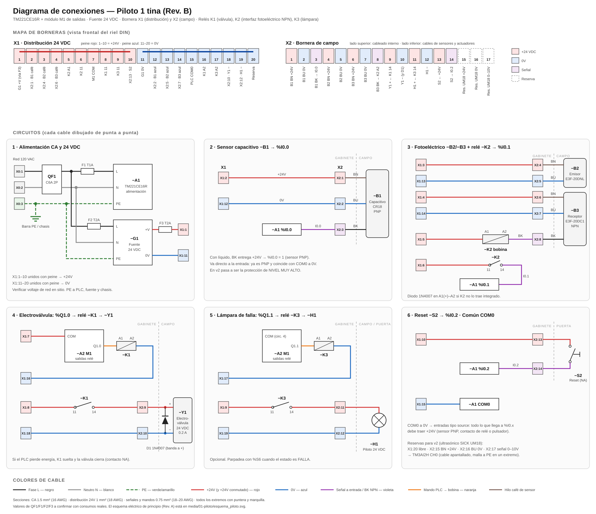

# Conexiones del tablero piloto (Rev. B)

Diagrama de conexiones y lista de cables del tablero piloto de una tina. Todo pasa por **borneras** (X1 para distribución de 24V, X2 para campo) y todas las cargas y el sensor NPN pasan por **relés de interfaz** (K1, K2, K3).



Archivo: [diagrama_conexiones.svg](diagrama_conexiones.svg). Ábrelo en el navegador para hacer zoom.

> **Rev. B vs. Rev. A:** el [esquema de principio Rev. A](../media/01-piloto/esquema_piloto.svg) no tiene K2 (interfaz del fotoeléctrico NPN), K3 (lámpara) ni las borneras numeradas. Este documento es el que se usa para cablear.

---

## 1. Criterios

| Criterio | Cómo se aplica |
|---|---|
| **Nada del campo entra directo al PLC** | Todos los cables de sensores y actuadores llegan a la bornera **X2**. Del X2 al PLC o a los relés va cableado interno. Cambiar un sensor no obliga a tocar el PLC. |
| **Distribución ordenada de 24V** | La bornera **X1** reparte el +24V (bornes 1–10) y el 0V (bornes 11–20) con **peines puente**. Cada equipo tiene su propio borne: no hay dos cables en un mismo tornillo. |
| **Cargas por relé** | El PLC solo mueve bobinas de relé. La válvula (K1) y la lámpara (K3) se alimentan por el contacto del relé. Si una carga hace corto, el daño se queda en el relé y no llega al módulo del PLC. |
| **Sensor NPN por relé** | El fotoeléctrico es NPN y las entradas del PLC están en modo PNP (COM0 a 0V). K2 adapta la señal sin cambiar el COM0 ni el capacitivo. |
| **Capacitivo directo** | El capacitivo ya es PNP y coincide con COM0 a 0V, así que no necesita relé. Si se quiere, se puede pasar por un relé igual que el fotoeléctrico. |
| **Falla segura** | Si se pierde la energía, K1 suelta y la válvula cierra. Si se corta el cable del fotoeléctrico, K2 suelta y el PLC lee "sin moldes". |

---

## 2. Bornes

### X1 · Distribución 24 VDC (peine rojo 1–10 = +24V · peine azul 11–20 = 0V)

| Borne | Potencial | Va a |
|---|---|---|
| X1:1 | +24V | Entrada desde G1 +V (vía F3) |
| X1:2 | +24V | X2:1 → B1 capacitivo (café) |
| X1:3 | +24V | X2:4 → B2 emisor (café) |
| X1:4 | +24V | X2:6 → B3 receptor (café) |
| X1:5 | +24V | K2 A1 (bobina) |
| X1:6 | +24V | K2 11 (contacto) |
| X1:7 | +24V | M1 COM (común de salidas del módulo) |
| X1:8 | +24V | K1 11 (contacto válvula) |
| X1:9 | +24V | K3 11 (contacto lámpara) |
| X1:10 | +24V | X2:13 → S2 reset |
| X1:11 | 0V | Entrada desde G1 0V |
| X1:12 | 0V | X2:2 → B1 capacitivo (azul) |
| X1:13 | 0V | X2:5 → B2 emisor (azul) |
| X1:14 | 0V | X2:7 → B3 receptor (azul) |
| X1:15 | 0V | PLC COM0 |
| X1:16 | 0V | K1 A2 (bobina) |
| X1:17 | 0V | K3 A2 (bobina) |
| X1:18 | 0V | X2:10 → Y1 válvula (−) |
| X1:19 | 0V | X2:12 → H1 lámpara (−) |
| X1:20 | 0V | Reserva |

### X2 · Campo (arriba: cableado interno · abajo: cable del equipo de campo)

| Borne | Interno (arriba) | Campo (abajo) |
|---|---|---|
| X2:1 | X1:2 (+24V) | B1 capacitivo — café |
| X2:2 | X1:12 (0V) | B1 capacitivo — azul |
| X2:3 | PLC %I0.0 | B1 capacitivo — negro (señal) |
| X2:4 | X1:3 (+24V) | B2 emisor — café |
| X2:5 | X1:13 (0V) | B2 emisor — azul |
| X2:6 | X1:4 (+24V) | B3 receptor — café |
| X2:7 | X1:14 (0V) | B3 receptor — azul |
| X2:8 | K2 A2 | B3 receptor — negro (salida NPN) |
| X2:9 | K1 14 | Y1 electroválvula (+) |
| X2:10 | X1:18 (0V) | Y1 electroválvula (−) |
| X2:11 | K3 14 | H1 lámpara (+) |
| X2:12 | X1:19 (0V) | H1 lámpara (−) |
| X2:13 | X1:10 (+24V) | S2 reset — borne 1 |
| X2:14 | PLC %I0.2 | S2 reset — borne 2 |
| X2:15 | Reserva v2 (+24V) | UM18 café |
| X2:16 | Reserva v2 (0V) | UM18 azul |
| X2:17 | Reserva v2 → TM3AI2H CH0 | UM18 señal 0–10V |

---

## 3. Lista de cables (qué va a qué)

Cada cable lleva **marquilla en los dos extremos** con el texto de la columna *Marquilla*.

### Alimentación CA

| # | Marquilla | Desde | Hacia | Color | Sección |
|---|---|---|---|---|---|
| 1 | L | Red 120 VAC — fase | X0:1 | Negro | 1.5 mm² (16 AWG) |
| 2 | N | Red 120 VAC — neutro | X0:2 | Blanco | 1.5 mm² |
| 3 | PE | Red — tierra | X0:3 | Verde/amarillo | 1.5 mm² |
| 4 | L | X0:1 | QF1 entrada L | Negro | 1.5 mm² |
| 5 | N | X0:2 | QF1 entrada N | Blanco | 1.5 mm² |
| 6 | PE | X0:3 | Barra PE / chasis | Verde/amarillo | 1.5 mm² |
| 7 | L1 | QF1 salida L | F1 (portafusible T1A) | Negro | 1.5 mm² |
| 8 | L1 | F1 | PLC −A1 terminal L | Negro | 1.5 mm² |
| 9 | N1 | QF1 salida N | PLC −A1 terminal N | Blanco | 1.5 mm² |
| 10 | PE | Barra PE | PLC −A1 terminal PE | Verde/amarillo | 1.5 mm² |
| 11 | L1 | QF1 salida L | F2 (portafusible T2A) | Negro | 1.5 mm² |
| 12 | L2 | F2 | Fuente −G1 L | Negro | 1.5 mm² |
| 13 | N1 | QF1 salida N | Fuente −G1 N | Blanco | 1.5 mm² |
| 14 | PE | Barra PE | Fuente −G1 PE | Verde/amarillo | 1.5 mm² |

### Fuente 24 VDC

| # | Marquilla | Desde | Hacia | Color | Sección |
|---|---|---|---|---|---|
| 15 | +24V | −G1 +V | F3 (portafusible T2A) | Rojo | 1 mm² (18 AWG) |
| 16 | +24V | F3 | X1:1 | Rojo | 1 mm² |
| 17 | 0V | −G1 0V | X1:11 | Azul | 1 mm² |
| — | — | Peine X1:1 → X1:10 | — | Peine rojo | — |
| — | — | Peine X1:11 → X1:20 | — | Peine azul | — |

### Circuito 2 · Sensor capacitivo −B1 → %I0.0

| # | Marquilla | Desde | Hacia | Color | Sección |
|---|---|---|---|---|---|
| 18 | +24V | X1:2 | X2:1 (arriba) | Rojo | 0.75 mm² |
| 19 | 0V | X1:12 | X2:2 (arriba) | Azul | 0.75 mm² |
| 20 | I0.0 | X2:3 (arriba) | PLC %I0.0 | Violeta | 0.75 mm² |
| 21 | — | B1 café | X2:1 (abajo) | Cable del sensor | — |
| 22 | — | B1 azul | X2:2 (abajo) | Cable del sensor | — |
| 23 | — | B1 negro | X2:3 (abajo) | Cable del sensor | — |

### Circuito 3 · Fotoeléctrico −B2/−B3 + relé −K2 → %I0.1

| # | Marquilla | Desde | Hacia | Color | Sección |
|---|---|---|---|---|---|
| 24 | +24V | X1:3 | X2:4 (arriba) | Rojo | 0.75 mm² |
| 25 | 0V | X1:13 | X2:5 (arriba) | Azul | 0.75 mm² |
| 26 | +24V | X1:4 | X2:6 (arriba) | Rojo | 0.75 mm² |
| 27 | 0V | X1:14 | X2:7 (arriba) | Azul | 0.75 mm² |
| 28 | K2-A2 | X2:8 (arriba) | K2 A2 | Violeta | 0.75 mm² |
| 29 | +24V | X1:5 | K2 A1 | Rojo | 0.75 mm² |
| 30 | +24V | X1:6 | K2 11 | Rojo | 0.75 mm² |
| 31 | I0.1 | K2 14 | PLC %I0.1 | Violeta | 0.75 mm² |
| 32 | — | B2 emisor café | X2:4 (abajo) | Cable del sensor | — |
| 33 | — | B2 emisor azul | X2:5 (abajo) | Cable del sensor | — |
| 34 | — | B3 receptor café | X2:6 (abajo) | Cable del sensor | — |
| 35 | — | B3 receptor azul | X2:7 (abajo) | Cable del sensor | — |
| 36 | — | B3 receptor negro | X2:8 (abajo) | Cable del sensor | — |

**Cómo funciona:** cuando el receptor detecta, su salida NPN (negro) cierra a 0V. Eso energiza la bobina de K2 (A1 está fijo a +24V), y su contacto 11–14 lleva +24V a %I0.1.

### Circuito 4 · Electroválvula: %Q1.0 → relé −K1 → −Y1

| # | Marquilla | Desde | Hacia | Color | Sección |
|---|---|---|---|---|---|
| 37 | +24V | X1:7 | M1 COM | Rojo | 0.75 mm² |
| 38 | Q1.0 | M1 Q1.0 | K1 A1 | Naranja | 0.75 mm² |
| 39 | 0V | K1 A2 | X1:16 | Azul | 0.75 mm² |
| 40 | +24V | X1:8 | K1 11 | Rojo | 0.75 mm² |
| 41 | Y1+ | K1 14 | X2:9 (arriba) | Rojo | 0.75 mm² |
| 42 | 0V | X1:18 | X2:10 (arriba) | Azul | 0.75 mm² |
| 43 | — | Y1 (+) | X2:9 (abajo) | Cable de la válvula | 0.75 mm² |
| 44 | — | Y1 (−) | X2:10 (abajo) | Cable de la válvula | 0.75 mm² |
| — | — | Diodo D1 1N4007 en los bornes de la válvula | banda (cátodo) a **+** | — | — |

### Circuito 5 · Lámpara de falla: %Q1.1 → relé −K3 → −H1 (opcional)

| # | Marquilla | Desde | Hacia | Color | Sección |
|---|---|---|---|---|---|
| 45 | Q1.1 | M1 Q1.1 | K3 A1 | Naranja | 0.75 mm² |
| 46 | 0V | K3 A2 | X1:17 | Azul | 0.75 mm² |
| 47 | +24V | X1:9 | K3 11 | Rojo | 0.75 mm² |
| 48 | H1+ | K3 14 | X2:11 (arriba) | Rojo | 0.75 mm² |
| 49 | 0V | X1:19 | X2:12 (arriba) | Azul | 0.75 mm² |
| 50 | — | H1 (+) | X2:11 (abajo) | — | 0.75 mm² |
| 51 | — | H1 (−) | X2:12 (abajo) | — | 0.75 mm² |

El COM del módulo M1 ya queda alimentado por el cable 37: Q1.0 y Q1.1 comparten ese común.

### Circuito 6 · Reset −S2 → %I0.2 y común de entradas

| # | Marquilla | Desde | Hacia | Color | Sección |
|---|---|---|---|---|---|
| 52 | +24V | X1:10 | X2:13 (arriba) | Rojo | 0.75 mm² |
| 53 | I0.2 | X2:14 (arriba) | PLC %I0.2 | Violeta | 0.75 mm² |
| 54 | — | S2 borne 1 (NA) | X2:13 (abajo) | — | 0.75 mm² |
| 55 | — | S2 borne 2 (NA) | X2:14 (abajo) | — | 0.75 mm² |
| 56 | 0V | X1:15 | PLC COM0 | Azul | 0.75 mm² |

**Total:** 56 conexiones (17 externas: red a X0 y equipos de campo a X2; 39 de cableado interno) y 2 peines.

---

## 4. Materiales

| Cantidad | Material | Nota |
|---|---|---|
| 3 | Borne de paso (X0) + 1 borne de tierra | O directo a QF1 si la entrada es corta |
| 20 | Bornes de paso para X1 (2.5 mm²) | Rojo/gris para 1–10, azul para 11–20 si hay colores |
| 2 | Peines puente de 10 polos | Uno para +24V, otro para 0V |
| 17 | Bornes de paso para X2 (2.5 mm²) | 3 quedan de reserva para el ultrasónico |
| 4 | Topes finales y separadores | Uno entre X1 y X2 |
| 3 | Relés 24 VDC con base para riel, 1 contacto NA mínimo (K1, K2, K3) | Preferible con LED y diodo integrado |
| 1 | Interruptor termomagnético 2P C6A (QF1) | |
| 3 | Portafusibles + fusibles T1A, T2A, T2A (F1, F2, F3) | |
| 1 | Fuente 24 VDC ≥ 2.5 A riel DIN (G1) | Margen para el HMI |
| 1 | Diodo 1N4007 (D1) | En la válvula |
| — | Cable 1.5 mm² negro, blanco, verde/amarillo; 1 mm² y 0.75 mm² rojo, azul, violeta, naranja | |
| — | Punteras, marquillas, canaleta ranurada, riel DIN | |

---

## 5. Orden sugerido en el gabinete

```
┌─────────────────────────────────────────────────────────────┐
│ RIEL 1:  QF1 │ F1 │ F2 │ G1 Fuente 24V │ F3                  │
├──────────────────────── canaleta ───────────────────────────┤
│ RIEL 2:  PLC TM221 + M1  │  K1 │ K2 │ K3                     │
├──────────────────────── canaleta ───────────────────────────┤
│ RIEL 3:  X0 │ PE │ X1 (1……20) │ tope │ X2 (1……17)            │
└────────── entrada de cables de campo por prensaestopas ─────┘
```

- Lo de potencia arriba, el control al centro y las borneras abajo, cerca de los prensaestopas. Los cables de campo entran por abajo y llegan directo a X2.
- Por la canaleta, separar la CA del cableado de 24V. Si comparten canaleta, en compartimentos distintos.
- Cada cable con puntera y marquilla en los dos extremos.

---

## 6. Antes de energizar

Seguir el [procedimiento de verificación del piloto](../media/01-piloto/README.md#procedimiento-de-verificación), y además:

- [ ] Continuidad punto a punto de los 56 cables contra esta tabla (marcar cada fila)
- [ ] Peines bien asentados: continuidad X1:1 ↔ X1:10 y X1:11 ↔ X1:20, y **sin** continuidad entre X1:10 y X1:11
- [ ] Diodo D1 con la banda hacia el + de la válvula
- [ ] K2: con el haz tapado, el LED de K2 enciende y el LED de %I0.1 en el PLC enciende
- [ ] K1: al forzar %Q1.0, el relé hace clic y llegan 24V a X2:9
