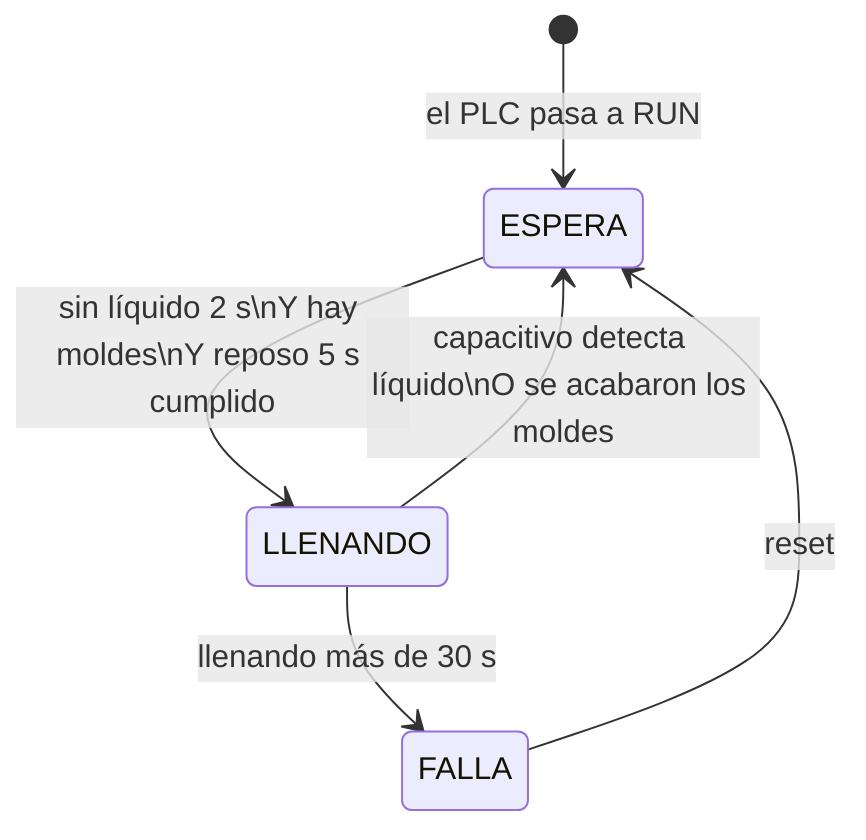
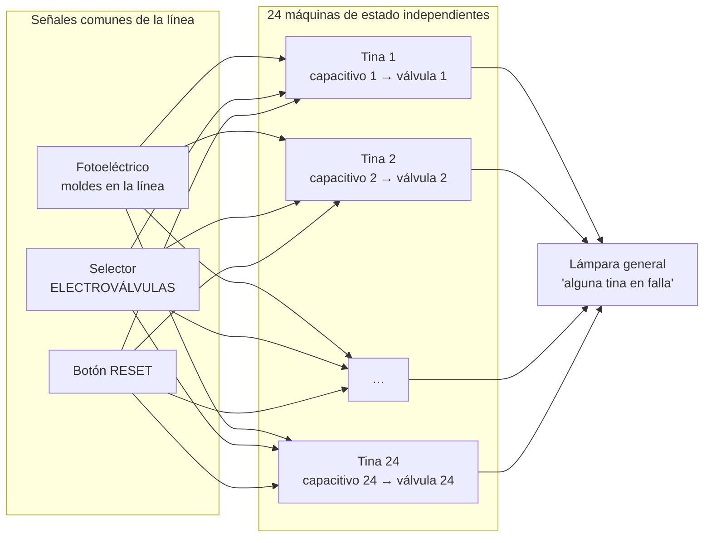
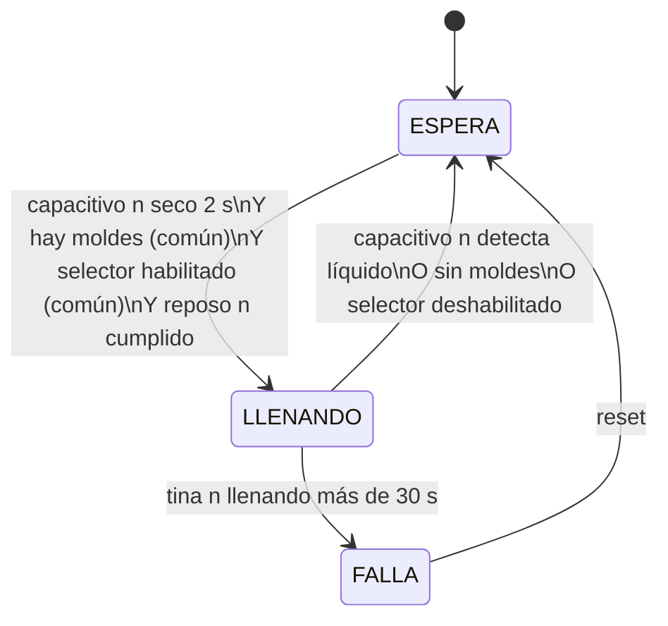
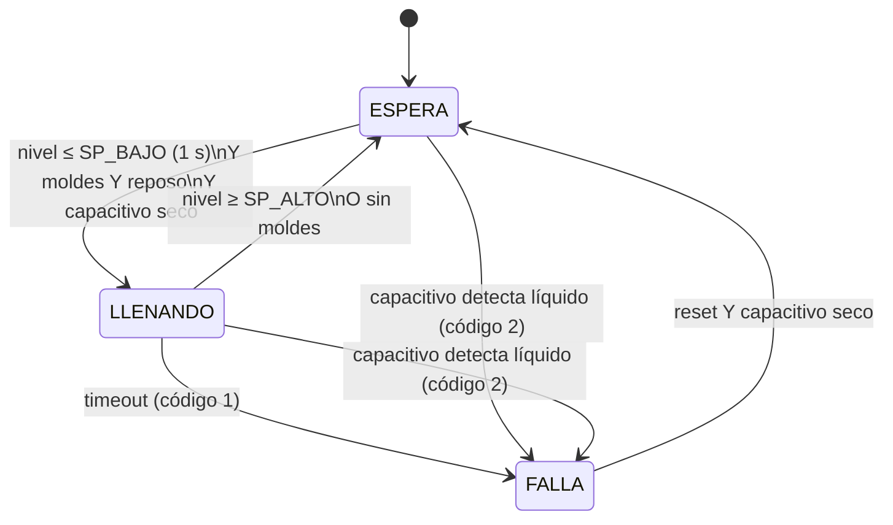

# Estados del sistema de llenado: hoy, 24 tinas y ultrasónico

**Proyecto:** Migración PLC — Línea de inmersión en látex (Productos Mayalatex)
**Controlador:** Schneider Modicon TM221CE16R · EcoStruxure Machine Expert Basic

Este documento explica la máquina de estados del llenado en tres etapas:

| Etapa | Sensores de nivel | Estado |
|---|---|---|
| **1. Hoy: piloto de 1 tina** | 1 capacitivo | ✅ Funcionando y verificado en tablero |
| **2. Línea completa: 24 tinas** | 24 capacitivos | Propuesta |
| **3. Con ultrasónico** | Ultrasónico + capacitivo de seguridad | Programa v2 escrito; falta que llegue el sensor |

La idea central es que **los estados no cambian entre etapas**. Siempre son ESPERA, LLENANDO y FALLA. Lo que cambia es cuántas veces se repite la máquina y de dónde viene la señal de nivel.

La explicación detallada de cada rung y cada timer está en [logica_del_sistema.md](logica_del_sistema.md).

---

## 1. Hoy: piloto de una tina

### Los tres estados

| `%MW0` | Estado | Válvula | Lámpara | Cómo se sale |
|---|---|---|---|---|
| **0** | **ESPERA** | Cerrada | Apagada | Cuando falta nivel 2 s, hay moldes y pasó el reposo de 5 s → LLENANDO |
| **1** | **LLENANDO** | Abierta | Apagada | El capacitivo detecta líquido o se acaban los moldes → ESPERA · pasan 30 s → FALLA |
| **2** | **FALLA** | **Bloqueada** | Parpadea | **Solo con reset** (`%M10` o el botón `%I0.2`) → ESPERA |



### Comportamiento verificado en el tablero

| Prueba | Resultado observado | ¿Es correcto? |
|---|---|---|
| Molde presente (`%I0.1` = 1) y capacitivo seco | A los ~7 s abre la válvula (`%Q1.0`) | ✅ 5 s de reposo + 2 s de nivel bajo |
| Se deja el capacitivo seco (en la mesa nada llena la tina) | A los 30 s la válvula cierra y la lámpara (`%Q1.1`) parpadea | ✅ Protección contra rebalse |
| Ya en FALLA, se repiten las condiciones de llenado | La válvula **no** abre | ✅ La falla queda enclavada |
| Reset con `%M10` = 1 y luego 0 | Vuelve a ESPERA | ✅ |
| Se apaga y enciende el PLC con las mismas condiciones | Arranca en ESPERA, llena 30 s y vuelve a FALLA | ✅ El Rung 0 reinicia; la falla vuelve porque la causa sigue |

**Para recordar:**
- En la mesa, sin nada que llene la tina, el programa **siempre** termina en FALLA a los 30 s. En la tina real, el látex sube, el capacitivo detecta y la válvula cierra antes.
- En FALLA la válvula no abre por nada hasta que una persona hace reset. Así alguien tiene que revisar antes de volver a operar.
- Hoy, apagar y encender el PLC también quita la falla. Si se quiere que solo el botón la quite, se puede cambiar.

### Entradas y salidas del piloto

| Dirección | Señal |
|---|---|
| `%I0.0` | Capacitivo (1 = hay líquido) |
| `%I0.1` | Fotoeléctrico vía relé K2 (1 = molde) |
| `%I0.2` | Botón de reset (pendiente de instalar) |
| `%Q1.0` | Relé K1 → electroválvula |
| `%Q1.1` | Relé K3 → lámpara de falla (pendiente de instalar) |

---

## 2. Línea completa: 24 tinas con capacitivos

### La idea: 24 máquinas de estado iguales e independientes

Cada tina tiene **su propia** máquina de estados, exactamente igual a la del piloto. Si la tina 7 entra en FALLA, solo se bloquea la tina 7 y las otras 23 siguen trabajando.

Algunas señales son **comunes a toda la línea** y entran a las 24 máquinas al mismo tiempo:



| Por tina (×24) | Común a la línea (×1) |
|---|---|
| Capacitivo de nivel | Fotoeléctrico de moldes (permiso de llenado) |
| Electroválvula + su relé | Selector ELECTROVÁLVULAS (habilitación general) |
| Estado: ESPERA / LLENANDO / FALLA | Botón de reset |
| Timer de nivel bajo (2 s) | Timer de moldes (TOF 5 s) |
| Timer de timeout (30 s) | Lámpara general de falla |
| Timer de reposo (5 s) | |

### Los estados de cada tina no cambian

Cada tina sigue el mismo diagrama del piloto. Lo único que se agrega es el selector como permiso general:



### Estado general de la línea

Además de los 24 estados, el PLC calcula un resumen para el operador y el HMI:

| Dato | Para qué |
|---|---|
| Cantidad de tinas LLENANDO | Ver cuánto látex se está pidiendo al mismo tiempo |
| Cantidad de tinas en FALLA | Lámpara general: parpadea si hay al menos una |
| Número de la primera tina en falla | Mostrarlo en el HMI o la computadora |

Con 24 tinas, la lámpara solo dice "hay un problema". Para saber **cuál** tina falló hace falta el HMI o el tablero en la computadora (Modbus TCP).

### Reset: general o por tina

| Opción | Cómo | Pros / contras |
|---|---|---|
| **Reset general** (recomendado para empezar) | Un botón resetea todas las tinas en FALLA | Simple, un solo botón. El operador debe revisar todas las tinas en falla antes de pulsar. |
| Reset por tina | Desde el HMI, tina por tina | Más control; requiere HMI |

### Cómo programarlo en Machine Expert Basic

Repetir 24 veces los ~10 rungs de una tina a mano son unos 240 rungs, con alto riesgo de equivocarse en una dirección. Hay dos caminos:

| Opción | Cómo | Ventajas | A verificar |
|---|---|---|---|
| **A. Bloque de función de usuario (UDFB)** (recomendado) | Se programa la lógica de **una tina** como bloque `FB_TINA` (entradas: capacitivo, moldes, habilitación, reset; salidas: válvula, falla, estado) y se usa 24 veces | Un solo lugar para corregir; si se mejora la lógica, mejora en las 24 tinas | El TM221 admite hasta **32 instancias de UDFB**, suficiente para 24. Confirmar que la versión de Machine Expert permite timers dentro del UDFB; si no, los timers se pasan como parámetros. |
| B. Copiar rungs con tabla de direcciones | Se pegan los rungs en IL 24 veces cambiando direcciones con buscar/reemplazar | No depende de funciones avanzadas | Muchos rungs y más riesgo de error |

**Recursos del PLC (verificados en el proyecto):**

| Recurso | Necesario para 24 tinas | Disponible en TM221CE16R |
|---|---|---|
| Timers `%TM` | 3 × 24 + 1 = **73** | 255 ✅ |
| Palabras `%MW` | ~100 (estados, contadores, parámetros) | 8000 ✅ |
| Bits `%M` | ~100 | 1024 ✅ |
| Instancias UDFB | 24 | 32 ✅ |

### Entradas y salidas para 24 tinas

| Señal | Cantidad |
|---|---|
| Entradas digitales: 24 capacitivos + fotoeléctrico + reset + selector + reserva | ~28–30 DI |
| Salidas digitales: 24 válvulas + lámpara general | ~25 DQ |

**Propuesta de módulos** (el orden en el IO Bus define la dirección):

| Posición | Módulo | Direcciones | Uso |
|---|---|---|---|
| CPU | TM221CE16R (9 DI / 7 DQ) | `%I0.0–%I0.8`, `%Q0.0–%Q0.6` | Señales comunes: fotoeléctrico, reset, selector · lámpara general |
| 1 | TM3DQ16R *(ya instalado)* | `%Q1.0–%Q1.15` | Válvulas tinas 1–16 |
| 2 | TM3DI16 *(en existencia)* | `%I2.0–%I2.15` | Capacitivos tinas 1–16 |
| 3 | TM3DI16 *(comprar)* | `%I3.0–%I3.7` | Capacitivos tinas 17–24 (8 de reserva) |
| 4 | TM3DQ16R *(comprar)* | `%Q4.0–%Q4.7` | Válvulas tinas 17–24 (8 de reserva) |

Con esta asignación, la tina *n* queda fácil de ubicar:

| Tina | Capacitivo | Válvula | Estado (para HMI) |
|---|---|---|---|
| 1 | `%I2.0` | `%Q1.0` | `%MW101` |
| 2 | `%I2.1` | `%Q1.1` | `%MW102` |
| … | … | … | … |
| 16 | `%I2.15` | `%Q1.15` | `%MW116` |
| 17 | `%I3.0` | `%Q4.0` | `%MW117` |
| … | … | … | … |
| 24 | `%I3.7` | `%Q4.7` | `%MW124` |

Al pasar a la línea completa, el piloto deja de usar `%I0.0` para el capacitivo y la lámpara se mueve de `%Q1.1` a `%Q0.0`. Es un cambio de direcciones, no de lógica.

### Consideraciones de la línea completa

| Tema | Por qué importa | Qué hacer |
|---|---|---|
| **Válvulas de producción** | El piloto usa una válvula de 24 VDC / 0.2 A. Las de producción pueden ser distintas (¿neumáticas con piloto? ¿otro voltaje?). | Confirmar el modelo antes de comprar relés y fuente |
| **Fuente de 24V** | Si las 24 válvulas fueran como la del piloto: 24 × 0.2 A = 4.8 A, más relés y sensores ≈ **6 A** en el peor caso | Fuente de 10 A, o fuente separada para válvulas |
| **Llenados al mismo tiempo** | Si muchas tinas piden látex a la vez, puede bajar la presión del suministro. Cada llenado tarda más y aparecen **falsas fallas por timeout**. | Medir; si pasa, limitar cuántas tinas llenan a la vez (por ejemplo, máximo 4) |
| **Distancia** | 24 tinas en serie ocupan muchos metros. Llevar 48+ cables a un solo gabinete es mucho cableado. | Evaluar cajas de bornes por zona, o I/O remota |
| **Relés de interfaz** | 24 relés para válvulas (criterio: cargas siempre por relé) | Bases de relé en riel con puente de comunes |
| **Ubicación del fotoeléctrico** | Las 24 tinas están en serie; los moldes pasan por todas | Un fotoeléctrico a la entrada de la línea como "la línea está trabajando". Si hay paros por zonas, uno por zona. |

---

## 3. Con el ultrasónico

### 3.1 Piloto con ultrasónico (programa v2)

Los estados **siguen siendo los mismos**. Cambian dos cosas:

1. **El nivel se mide en milímetros** y la válvula usa dos puntos (histéresis): abre al bajar de **SP_BAJO** y cierra al llegar a **SP_ALTO**. Entre los dos puntos no conmuta, así que la válvula trabaja mucho menos.
2. **El capacitivo cambia de función:** se sube unos milímetros por encima del nivel normal y pasa a ser la **protección de NIVEL MUY ALTO**. Si se moja, el sistema entra en FALLA desde cualquier estado.



```
nivel (mm)
   │  ── capacitivo ALTO-ALTO ── → FALLA (protección)
   │
   │  ── SP_ALTO ─────────────── → cierra la válvula
   │        ▲ banda de trabajo: aquí la válvula no conmuta
   │  ── SP_BAJO ─────────────── → abre la válvula
   │
```

**Comparación v1 → v2:**

| | v1 (hoy) | v2 (con ultrasónico) |
|---|---|---|
| Sensor que controla | Capacitivo (un punto) | Ultrasónico (nivel continuo en mm) |
| Abre cuando | El capacitivo está seco 2 s | El nivel baja de SP_BAJO 1 s |
| Cierra cuando | El capacitivo detecta líquido | El nivel llega a SP_ALTO |
| Ciclos de válvula | Muchos, cortos | Pocos, largos |
| Protección contra rebalse | Timeout de 30 s | Timeout **y** capacitivo de nivel muy alto (dos protecciones independientes) |
| Código de falla | — | `%MW1`: 1 = timeout, 2 = nivel muy alto |
| Reset | Siempre | Solo si el capacitivo ya está seco |
| Ajuste del nivel | Mover el sensor físicamente | Cambiar SP_BAJO / SP_ALTO en el programa o desde el HMI |
| Rungs | 13 | 19 |

Programa: [plc/fsm_llenado_v2.il](../plc/fsm_llenado_v2.il). Detalle técnico en el [documento del proyecto](../proyecto_plc_tinas_latex.md#fsm-v2-ultrasónico--fotoeléctrico--capacitivo-de-seguridad--electroválvula).

### 3.2 Ultrasónico en las 24 tinas

Los estados de cada tina serían los de v2. El reto es el **hardware**: 24 ultrasónicos son 24 **entradas analógicas**, además de las 24 entradas digitales de los capacitivos de seguridad.

| Opción | Cómo | Pros | Contras |
|---|---|---|---|
| **A. Módulos analógicos de 8 canales** (TM3AI8) | 3 módulos × 8 canales = 24 | Mismo PLC, señal 0–10V | Junto con los 4 módulos digitales serían **7 módulos, el máximo del TM221**: no queda margen |
| **B. IO-Link** | El UM18 soporta IO-Link. Un maestro IO-Link recoge varios sensores y el PLC lo lee por Ethernet (Modbus TCP) | Menos cableado analógico, diagnóstico del sensor, datos para monitoreo | Hay que comprar maestros IO-Link; programación de comunicación |
| **C. PLC más grande** (M241 / M251) | Más módulos y mejor manejo de red | Margen para crecer, HMI y datos | Costo; migrar el programa (la lógica de estados es la misma) |
| **D. Mixto** | Ultrasónico solo en las tinas más críticas; en el resto, dos capacitivos (bajo y alto) | Menor costo, hardware sencillo | Dos tipos de tina en el programa |

**Recomendación:** validar primero el ultrasónico en el piloto. Si mejora claramente el control (menos ciclos de válvula, nivel más estable), decidir entre **B (IO-Link)** y **C (M241/M251)** para la línea completa. Si la mejora es pequeña, la opción de **dos capacitivos por tina** da casi el mismo beneficio con hardware digital barato.

---

## 4. Resumen

| | Piloto hoy | 24 tinas (capacitivos) | Con ultrasónico |
|---|---|---|---|
| Estados por tina | ESPERA / LLENANDO / FALLA | Igual | Igual |
| Máquinas de estado | 1 | 24 independientes | 1 (piloto) o 24 |
| Señal de nivel | Capacitivo (un punto) | Capacitivo (un punto) por tina | Ultrasónico (mm) + capacitivo de seguridad |
| Protección contra rebalse | Timeout | Timeout por tina | Timeout + nivel muy alto |
| Señales comunes | Moldes | Moldes, selector, reset, lámpara | Igual |
| Programación | 13 rungs | UDFB `FB_TINA` × 24 | v2: 19 rungs por tina |
| Hardware de E/S | CPU + 1 módulo | CPU + 4 módulos | Analógicos o IO-Link; posible cambio de PLC |

## 5. Próximos pasos

1. Instalar el botón de reset (`%I0.2`) y la lámpara o botón iluminado (`%Q1.1`) en el piloto.
2. Probar el piloto en la tina real y medir: tiempo normal de llenado (para el timeout) y aperturas de válvula por hora.
3. Cuando llegue el ultrasónico: cargar v2 en el piloto y comparar contra v1.
4. Confirmar el modelo de las electroválvulas de producción.
5. Con esos datos, decidir la arquitectura de la línea completa (capacitivos simples, dos capacitivos, ultrasónico con IO-Link o PLC más grande).
