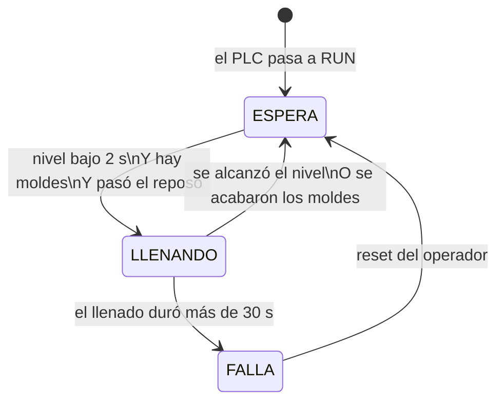

# Lógica del sistema de llenado — Piloto de una tina

**Proyecto:** Migración PLC — Línea de inmersión en látex (Productos Mayalatex)
**Controlador:** Schneider Modicon TM221CE16R · EcoStruxure Machine Expert Basic
**Programa:** FSM de llenado v1, 13 rungs · POU *Latex pools*

Este documento explica **cómo piensa** el programa: qué problema resuelve, por qué está armado como está y qué hace en cada situación, incluidas las fallas. Para capturarlo en Machine Expert está la [guía paso a paso](../plc/README.md). Para el detalle técnico completo, el [documento del proyecto](../proyecto_plc_tinas_latex.md).

---

## 1. El problema

Cada tina de látex tiene que mantenerse llena para que los moldes se sumerjan siempre a la misma profundidad. Hoy el llenado lo controla un relé: cuando el sensor deja de ver líquido, se abre la válvula.

Esa lógica tiene tres debilidades, y la primera ya causó rebalses:

1. **Si el sensor falla, la válvula queda abierta.** Un cable cortado o un sensor dañado se ven igual que "no hay líquido", así que la válvula abre y nadie la cierra.
2. **Abre y cierra muchas veces.** El sensor detecta un solo punto. Con el oleaje que generan los agitadores y los moldes al entrar, el nivel sube y baja alrededor de ese punto, y la válvula conmuta sin parar.
3. **No sabe si hay producción.** Llena aunque no estén pasando moldes.

El programa nuevo resuelve las tres.

---

## 2. Qué ve y qué controla el PLC

### Entradas

| Señal | Dirección | Símbolo | Significado |
|---|---|---|---|
| Sensor capacitivo (Autonics CR18) | `%I0.0` | `CAP_NIVEL` | **1 = hay líquido** en el punto de nivel |
| Fotoeléctrico de barrera (E3F-20, vía relé K2) | `%I0.1` | `FOTO_MOLD` | **1 = un molde está cortando el haz** |
| Pulsador de reset (opcional) | `%I0.2` | `BTN_RESET` | 1 = el operador pide reiniciar después de una falla |

### Salidas

| Señal | Dirección | Símbolo | Qué hace |
|---|---|---|---|
| Electroválvula de llenado | `%Q1.0` | `EV_LLENADO` | 1 = activa el relé K1, que abre la válvula |
| Lámpara de falla | `%Q1.1` | `LAMP_FALLA` | Parpadea cuando el sistema está en falla |

### Memorias internas

| Dirección | Símbolo | Para qué sirve |
|---|---|---|
| `%MW0` | `ESTADO` | Guarda en qué estado está el sistema: 0, 1 o 2 |
| `%M0` | `SENSOR_CAPACITIVO` | Copia interna del capacitivo |
| `%M1` | `MOLDE_DET` | Copia interna del fotoeléctrico |
| `%M10` | `RESET_SW` | Reset desde la computadora (tabla de animación) |

¿Por qué copiar las entradas a memorias (`%I0.0` → `%M0`, `%I0.1` → `%M1`)? Porque así **la polaridad de cada sensor se decide en un solo lugar**. Si un sensor resulta invertido, se cambia un contacto en el Rung 1 o el Rung 2 y todo lo demás sigue funcionando sin tocarlo.

---

## 3. La idea central: una máquina de estados

En lugar de "sensor → válvula" directo, el programa trabaja con **estados**. Un estado es una situación en la que se encuentra el sistema y que dura en el tiempo. El sistema está siempre en **uno y solo uno** de ellos, guardado como número en `%MW0`.

| `%MW0` | Estado | Válvula | Qué significa |
|---|---|---|---|
| **0** | **ESPERA** | Cerrada | Todo normal; no hace falta llenar o no se cumplen las condiciones |
| **1** | **LLENANDO** | Abierta | Se está llenando la tina |
| **2** | **FALLA** | Cerrada | Algo salió mal. Se queda bloqueado hasta que una persona lo reinicie |

Del estado en que está, el sistema pasa a otro solo cuando se cumple una **condición de transición**:



**Por qué una máquina de estados y no un rung directo:**
- **Memoria.** El sistema "recuerda" que está llenando o que hubo una falla. Un rung directo solo reacciona a lo que ve en ese instante.
- **Falla enclavada.** Si algo sale mal, el sistema se queda en FALLA aunque la causa desaparezca, y obliga a una persona a revisar. Una lógica directa volvería a intentar llenar sola.
- **Fácil de entender y de crecer.** Cada estado y cada transición es una regla que se puede leer en voz alta. Agregar el ultrasónico, la HMI o una alarma nueva es agregar una condición, no rehacer el programa.

---

## 4. Las señales filtradas: los cuatro timers

Las señales de los sensores llegan "crudas": con rebotes, oleaje y huecos. Antes de que la máquina de estados tome decisiones, cuatro timers las limpian. Todos usan base de tiempo de 1 s.

### `%TM0` · T_NIVEL_BAJO · TON 2 s · *¿de verdad falta líquido?*

**Entrada:** `%M0` **negado**, es decir, "no hay líquido".
**Salida `%TM0.Q`:** se activa solo si falta líquido **2 segundos seguidos**.

Un TON (*Timer ON-delay*) retrasa el encendido: la entrada tiene que mantenerse activa todo el tiempo de preset. Si se interrumpe antes, vuelve a contar desde cero.

```
Sensor (hay líquido)   ‾‾‾‾\_/‾‾‾\___________________/‾‾‾‾
                           ↑ ola (0.5 s)
%TM0.Q (nivel bajo)    _____________/‾‾‾‾‾‾‾‾‾‾‾‾‾‾‾\_____
                       la ola no     ↑ 2 s después de que
                       lo activa       el nivel realmente bajó
```

**Para qué:** que una ola o una salpicadura no abra la válvula.

### `%TM1` · T_MOLDES · TOF 5 s · *¿la línea está pasando moldes?*

**Entrada:** `%M1`, molde cortando el haz.
**Salida `%TM1.Q`:** se activa **al instante** cuando pasa un molde y **se mantiene 5 s** después de que pasó el último.

Un TOF (*Timer OFF-delay*) es lo contrario de un TON: enciende de inmediato y retrasa el apagado.

```
Fotoeléctrico (molde)  _/‾\___/‾\____/‾\___________________
                         molde molde  molde
%TM1.Q (hay moldes)    _/‾‾‾‾‾‾‾‾‾‾‾‾‾‾‾‾‾‾‾‾‾\____________
                                          ↑ 5 s después del
                                            último molde
```

**Para qué:** el fotoeléctrico ve cada molde como un pulso, con huecos entre uno y otro. Sin el TOF, cada hueco cortaría el llenado. Con él, la señal significa "la línea está trabajando". El preset debe ser **mayor que el hueco más largo entre moldes**.

### `%TM2` · T_TIMEOUT · TON 30 s · *¿el llenado está tardando demasiado?*

**Entrada:** `ESTADO = 1` (LLENANDO).
**Salida `%TM2.Q`:** se activa si el sistema lleva **30 s seguidos** llenando.

Empieza a contar al abrir la válvula y se reinicia cada vez que el sistema sale de LLENANDO. En un llenado normal nunca llega a 30. Si llega, algo está mal:
- el sensor de nivel no detecta (dañado, desconectado, sucio);
- la válvula no abre (bobina quemada, relé K1 dañado);
- no hay suministro de látex;
- hay una fuga.

**Para qué:** es la **protección principal contra rebalses**. El preset se calibra en 1.5 a 2 veces el tiempo normal de llenado medido.

### `%TM3` · T_REPOSO · TON 5 s · *¿ya se asentó la superficie?*

**Entrada:** `ESTADO = 0` (ESPERA).
**Salida `%TM3.Q`:** se activa cuando el sistema lleva **5 s en ESPERA**.

**Para qué:** al cerrar la válvula, la superficie sigue moviéndose y el sensor puede volver a ver "nivel bajo" casi de inmediato. El reposo obliga a esperar antes de un nuevo llenado y evita el abre-cierra que desgasta el solenoide.

---

## 5. Las transiciones, una por una

### ESPERA → LLENANDO (Rung 9)

```
ESTADO = 0   Y   %TM0.Q   Y   %TM1.Q   Y   %TM3.Q      →   ESTADO := 1
(en espera)      (nivel bajo   (hay moldes)  (pasó el
                  2 s)                        reposo)
```

**Las cuatro** condiciones tienen que cumplirse al mismo tiempo. Basta que falte una para que no llene:
- con nivel bajo pero sin moldes → no llena (no hay producción);
- con nivel bajo y moldes, pero recién cerró → espera el reposo;
- con moldes pero nivel bien → no hace falta.

### LLENANDO → ESPERA (Rung 8)

```
ESTADO = 1   Y   ( %M0   O   NO %TM1.Q )      →   ESTADO := 0
(llenando)       (ya hay     (se acabaron
                  líquido)    los moldes)
```

Es una condición **O**, la rama en paralelo del ladder: basta una de las dos para dejar de llenar.
- **Se alcanzó el nivel:** el caso normal. Aquí no hay timer: **la válvula cierra al instante**. Para abrir el sistema es paciente (2 s); para cerrar, inmediato. Esa asimetría es intencional: es más grave llenar de más que de menos.
- **Se acabaron los moldes:** la línea se detuvo; no tiene sentido seguir llenando.

### LLENANDO → FALLA (Rung 7)

```
ESTADO = 1   Y   %TM2.Q      →   ESTADO := 2
(llenando)       (pasaron 30 s)
```

Si el llenado no terminó en 30 s, el sistema **deja de confiar en sí mismo**: cierra la válvula y se bloquea.

### FALLA → ESPERA (Rung 10)

```
ESTADO = 2   Y   ( %I0.2   O   %M10 )      →   ESTADO := 0
(en falla)       (botón        (reset por
                  reset)        software)
```

**Solo una persona** puede sacar al sistema de FALLA. La idea es que alguien revise la tina, el sensor y la válvula antes de volver a operar. Mientras no haya botón físico, el reset se hace forzando `%M10` a 1 (y regresándolo a 0) desde la tabla de animación.

### Arranque (Rung 0)

```
%S13 (primer ciclo)      →   ESTADO := 0
```

`%S13` es un bit del sistema que vale 1 **solo en el primer ciclo** después de pasar a RUN. Garantiza que el PLC siempre arranque en ESPERA, con la válvula cerrada, aunque antes del corte de energía estuviera llenando o en falla.

---

## 6. La salida: doble seguridad en la válvula (Rung 11)

```
ESTADO = 1   Y   NO %M0   Y   %TM1.Q      →   %Q1.0 (válvula abierta)
(llenando)       (no hay      (hay moldes)
                  líquido)
```

Bastaría con "ESTADO = 1 → válvula". Sin embargo, el rung vuelve a preguntar por el nivel y los moldes. Es una **segunda barrera**: si por algún error de programa (un rung mal editado, un forzado olvidado) el estado quedara en 1 de forma indebida, la válvula igual **no abre si ya hay líquido o si no hay moldes**.

En sistemas que pueden causar daño, la salida física no se confía a una sola condición.

---

## 7. La lámpara de falla (Rung 12)

```
ESTADO = 2   Y   %S6      →   %Q1.1
```

`%S6` es un reloj del sistema que alterna cada medio segundo. Al combinarlo con "estado en FALLA", la lámpara **parpadea**, algo que llama más la atención que una luz fija.

---

## 8. Cómo ejecuta el PLC el programa: el ciclo de scan

El PLC no ejecuta los rungs "cuando pasa algo". Repite este ciclo continuamente, en unos pocos milisegundos:

```
┌──────────────────────────────────────────────────┐
│ 1. Lee TODAS las entradas físicas (%I)           │
│ 2. Ejecuta los rungs EN ORDEN: 0, 1, 2, … 12     │
│ 3. Escribe TODAS las salidas físicas (%Q)        │
└──────────────────────── repite ──────────────────┘
```

Por eso **el orden de los rungs importa**:

| Grupo | Rungs | Por qué va en este lugar |
|---|---|---|
| Arranque | 0 | Lo primero: fija el estado inicial |
| Lectura de sensores | 1–2 | Las memorias `%M0` y `%M1` deben estar actualizadas antes de usarlas |
| Timers | 3–6 | Las señales filtradas deben estar listas antes de las decisiones |
| Transiciones que **salen** de LLENANDO | 7–8 | Van **antes** de la que **entra** (9). Así, en un mismo scan, el sistema no puede salir de LLENANDO y volver a entrar sin pasar por el reposo. |
| Transición que **entra** a LLENANDO | 9 | |
| Reset | 10 | |
| Salidas | 11–12 | Al final, cuando el estado ya está decidido |

---

## 9. Un ciclo completo, paso a paso

Ejemplo de una tina en operación normal (los tiempos son ilustrativos):

| Tiempo | Qué pasa en la planta | Qué hace el PLC | Estado | Válvula |
|---|---|---|---|---|
| 0 s | Tina llena, pasan moldes | `%M0` = 1, `%TM1.Q` = 1 | ESPERA | Cerrada |
| 40 s | Los moldes se llevaron látex; el nivel baja del sensor | `%M0` = 0, `%TM0` empieza a contar | ESPERA | Cerrada |
| 40.5 s | Una ola toca el sensor | `%M0` = 1 un instante → `%TM0` vuelve a 0 | ESPERA | Cerrada |
| 41 s | El nivel está realmente bajo | `%TM0` cuenta de nuevo | ESPERA | Cerrada |
| 43 s | Pasaron 2 s seguidos sin líquido | `%TM0.Q` = 1; hay moldes; el reposo ya pasó hace rato → **Rung 9** | **LLENANDO** | **Abierta** |
| 43–55 s | Entra látex | `%TM2` cuenta: 1, 2, … 12 | LLENANDO | Abierta |
| 55 s | El líquido llega al sensor | `%M0` = 1 → **Rung 8** | **ESPERA** | **Cerrada al instante** |
| 55–60 s | La superficie se asienta | `%TM3` cuenta el reposo | ESPERA | Cerrada |
| 60 s | Listo para el siguiente ciclo | `%TM3.Q` = 1 | ESPERA | Cerrada |

El llenado tardó 12 s, muy por debajo de los 30 s del timeout.

---

## 10. Qué pasa cuando algo falla

| Falla | Qué ve el PLC | Qué hace el sistema | ¿Rebalsa? |
|---|---|---|---|
| Cable del capacitivo cortado | `%I0.0` = 0, "no hay líquido" para siempre | Llena, y a los 30 s pasa a **FALLA** y cierra | **No**: el timeout lo corta |
| Capacitivo pegado en "hay líquido" | `%M0` = 1 siempre | No llena nunca. La tina se vacía de a poco. | No (riesgo inverso: tina vacía) |
| Válvula no abre (bobina, relé K1) | Abre la salida pero el nivel no sube | A los 30 s: **FALLA** | No |
| Sin suministro de látex | Igual que el caso anterior | A los 30 s: **FALLA** | No |
| Cable del fotoeléctrico cortado (modo Dark-ON) | `%I0.1` = 0, "sin moldes" | No llena | No |
| Emisor apagado o sucio (modo Dark-ON) | `%I0.1` = 1, "hay moldes" siempre | Llena cuando falta nivel, como si hubiera producción | No: el capacitivo y el timeout siguen activos |
| Corte de energía mientras llena | El PLC se apaga: K1 se suelta | **La válvula cierra** (contacto NA). Al volver: arranca en ESPERA. | No |
| PLC en STOP | Salidas en 0 | Válvula cerrada | No |

El caso "capacitivo pegado en hay líquido" no rebalsa, pero deja la tina sin llenar. La versión 2, con el ultrasónico, lo detecta mejor porque mide el nivel de forma continua.

---

## 11. Resumen rung por rung

| Rung | Nombre | Lógica | En una frase |
|---|---|---|---|
| 0 | Inicialización | `%S13` → `ESTADO := 0` | Arrancar siempre en ESPERA |
| 1 | Sensor capacitivo | `%I0.0` → `%M0` | Leer el nivel |
| 2 | Fotoeléctrico | `%I0.1` → `%M1` | Leer los moldes |
| 3 | Nivel bajo confirmado | NO `%M0` → `%TM0` TON 2 s | Falta líquido de verdad |
| 4 | Moldes presentes | `%M1` → `%TM1` TOF 5 s | La línea está trabajando |
| 5 | Timeout llenado | `ESTADO = 1` → `%TM2` TON 30 s | Vigilar que el llenado no dure demasiado |
| 6 | Reposo | `ESTADO = 0` → `%TM3` TON 5 s | Dejar asentar antes de volver a llenar |
| 7 | LLENANDO a FALLA | `ESTADO = 1` Y `%TM2.Q` → `ESTADO := 2` | Tardó demasiado: bloquear |
| 8 | LLENANDO a ESPERA | `ESTADO = 1` Y (`%M0` O NO `%TM1.Q`) → `ESTADO := 0` | Ya se llenó o paró la línea |
| 9 | ESPERA a LLENANDO | `ESTADO = 0` Y `%TM0.Q` Y `%TM1.Q` Y `%TM3.Q` → `ESTADO := 1` | Falta líquido, hay moldes y ya reposó: llenar |
| 10 | Reset falla | `ESTADO = 2` Y (`%I0.2` O `%M10`) → `ESTADO := 0` | Una persona reinicia |
| 11 | Electroválvula | `ESTADO = 1` Y NO `%M0` Y `%TM1.Q` → `%Q1.0` | Abrir la válvula, con doble seguridad |
| 12 | Lámpara falla | `ESTADO = 2` Y `%S6` → `%Q1.1` | Avisar la falla parpadeando |

Diagrama ladder completo: [plc/ladder_fsm_v1.svg](../plc/ladder_fsm_v1.svg)

---

## 12. Parámetros que se calibran en planta

| Parámetro | Valor inicial | Cómo calibrarlo | Si queda muy bajo | Si queda muy alto |
|---|---|---|---|---|
| `%TM0` nivel bajo | 2 s | Observar cuánto duran las olas sobre el sensor | La válvula abre por olas | Tarda más en reaccionar |
| `%TM1` moldes | 5 s | Medir el hueco más largo entre moldes y multiplicar por 1.5 | El llenado se corta en cada hueco | Sigue llenando un rato después de que paró la línea |
| `%TM2` timeout | 30 s | Medir varios llenados normales; usar 1.5–2 veces el más largo | Falsas fallas en llenados normales | Una falla tarda más en detectarse: más látex derramado |
| `%TM3` reposo | 5 s | Observar cuánto tarda en asentarse la superficie | Abre-cierra seguido | Más tiempo con la tina bajo nivel |

---

## 13. Lo que viene

- **Versión 2, con el ultrasónico SICK UM18** ([plc/fsm_llenado_v2.il](../plc/fsm_llenado_v2.il)):
  - el nivel se mide de forma continua en milímetros;
  - la válvula abre en un punto bajo (SP_BAJO) y cierra en uno alto (SP_ALTO). Esa histéresis reemplaza buena parte del trabajo del reposo;
  - el capacitivo se reubica arriba del nivel normal como **protección de nivel muy alto**, un segundo sensor independiente que manda a FALLA si el ultrasónico se equivoca.
- **Monitoreo en computadora o HMI:** el estado, el nivel, la válvula y las fallas se leen por Modbus TCP para mostrarlos en un tablero y registrar datos.

La máquina de estados no cambia: ESPERA, LLENANDO y FALLA siguen siendo los mismos tres estados. Solo cambia de dónde viene la señal de nivel y se agrega una condición más de falla.

---

## Glosario

| Término | Significado |
|---|---|
| **Contacto NA `-| |-`** | Deja pasar si el bit vale 1 |
| **Contacto NC `-|/|-`** | Deja pasar si el bit vale 0 ("negado") |
| **Bobina `-( )-`** | Escribe 1 o 0 en un bit, según si le llega señal |
| **Bloque de comparación `[ ]`** | Pregunta por un valor numérico, por ejemplo `%MW0 = 1` |
| **Bloque de operación `[ := ]`** | Asigna un valor numérico, por ejemplo `%MW0 := 2` |
| **Serie** | Elementos uno tras otro: condición **Y** |
| **Paralelo (rama)** | Elementos uno sobre otro: condición **O** |
| **TON** | Timer que retrasa el encendido: la entrada debe mantenerse el tiempo de preset |
| **TOF** | Timer que retrasa el apagado: la salida se mantiene el tiempo de preset después de que la entrada se apaga |
| **`%TMx.Q`** | Salida del timer x (1 = cumplió su condición) |
| **`%I` / `%Q`** | Entradas / salidas físicas |
| **`%M` / `%MW`** | Memoria interna de un bit / de una palabra (número de 16 bits) |
| **`%S13`** | Bit del sistema: 1 solo en el primer ciclo después de RUN |
| **`%S6`** | Bit del sistema: reloj que alterna cada 0.5 s |
| **Scan** | Ciclo del PLC: leer entradas → ejecutar rungs en orden → escribir salidas |
| **Enclavar** | Quedarse en un estado aunque la causa desaparezca, hasta una acción manual |
| **Dark-ON / Light-ON** | Fotoeléctrico que activa su salida con el haz tapado / libre |
