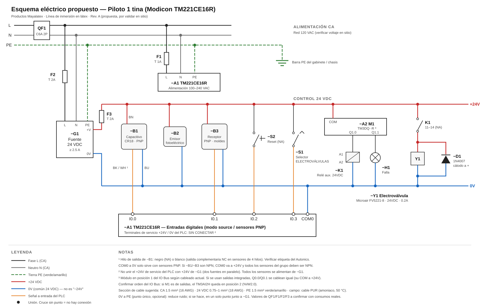

# Fase 1 — Piloto de una tina

## Esquema de conexión del piloto (borrador a mano)

**Archivo:** `circuito plc.jpeg` — esquema a mano del tablero piloto. La foto está girada 90°: girar la página a la derecha para leerla.

### Lectura del esquema

> Interpretación del dibujo. Las líneas marcadas con *(?)* no se distinguen bien en la foto y deben confirmarse.

| Desde | Hacia | Observación |
|---|---|---|
| Alimentación CA (marcas ① y ②) | PLC terminal **AC** | L y N del PLC (100-240VAC) |
| Fuente **+** | Bornera **+24VDC** *(?)* | La línea del + se corta antes de llegar a la bornera en el dibujo |
| Fuente **−** | Bornera **−24VDC** (0V) | Unión marcada con punto |
| PLC **COM** (entradas) | PLC **0V** | Puente entre ambos terminales → entradas en modo **source**, sensor **PNP** |
| Sensor **café** | Bornera +24VDC | Alimentación + |
| Sensor **azul** | Bornera −24VDC | Alimentación 0V |
| Sensor **blanco** | Bornera **I0.0** → PLC %I0.0 | Señal |
| Módulo **M1**, salida **Q1.0** | Relé auxiliar bobina (A1/A2) | Salida de la expansión |
| Módulo **M1**, **COM** | +24VDC *(?)* | Común de la salida de relé |
| Relé **A2** (o A1) | 0V *(?)* | Retorno de bobina |
| Relé **COM** (contacto) | +24VDC | Unión con punto en la línea horizontal |
| Relé **NO** (contacto) | Electroválvula **+** | |
| Electroválvula **−** | −24VDC (0V) | |

### Revisión

**✅ Correcto / buena práctica**
- La salida del PLC acciona un **relé auxiliar** y su contacto conmuta la electroválvula, como se acordó.
- El sensor está alimentado desde bornera y no directo al PLC, lo que facilita el mantenimiento.
- El contacto **NO** del relé abre la válvula: si el PLC pierde energía, la válvula cierra.

**⚠️ A verificar**
1. **Un solo 0V común.** Aparecen dos fuentes de 24V: la fuente externa y la salida de sensores del PLC (**+24 / 0V**). El COM de las entradas está unido al **0V del PLC**, pero el sensor se alimenta de la **fuente externa**. Para que %I0.0 detecte, el retorno tiene que cerrar el lazo por la misma fuente que alimenta al sensor. Solución propuesta (ver esquema abajo): **COM0 directo al 0V de la fuente externa** y los terminales de servicio +24V/0V del PLC sin conectar. Si el COM queda referido a otra fuente, la entrada nunca se activa aunque el sensor encienda su LED.
2. **No unir los dos +24V.** El +24 de la fuente externa y el +24 de sensores del PLC **no** deben conectarse entre sí (dos fuentes en paralelo). Se usa una u otra para los sensores. Recomendado: la **fuente externa**, y dejar libre el +24 del PLC.
3. **El cable blanco del sensor.** En sensores de 3 hilos el código estándar es café (+), azul (0V) y **negro** (salida). Si el sensor tiene 4 hilos, el **blanco** suele ser la salida **complementaria (NC)**: la lógica queda invertida respecto al negro. Hay que revisarlo en la etiqueta o el manual del Autonics. Esto también explica la duda de polaridad que ya estaba anotada.
4. **Puente COM–0V = sensor PNP.** Esto solo funciona si el sensor es **PNP** (sufijo DP). Si es **NPN** (DN), el COM debe ir a **+24V**.
5. **Módulo M1.** El dibujo confirma que hay un **módulo de salidas digitales en la posición 1** (Q1.0). Entonces el **TM3AI2H no es el Module 1**: si se agrega después, quedaría en la posición 2 → el ultrasónico sería **%IW2.0**. Confirmar el modelo de M1 (¿TM3DQ16R de relés?) y el orden en *Configuration → IO Bus*.
6. **COM del módulo M1.** En un módulo de relés, el COM recibe el voltaje que se va a conmutar (+24VDC para la bobina del relé auxiliar). Confirmar a dónde va el COM en el dibujo.

**❌ Falta en el esquema**
- **Tierra (PE)** del PLC y de la fuente. El PE del PLC es obligatorio por seguridad y por ruido.
- **Protección** antes del PLC y de la fuente: termomagnético y fusible tipo T.
- **Alimentación CA de la fuente externa.**
- **Diodo de rueda libre** (1N4007) en antiparalelo con la bobina de la electroválvula (cátodo al +). Opcional también en la bobina del relé, si no lo trae integrado.
- **Fotoeléctrico** (%I0.1), aún no dibujado.

### Nomenclatura
En el dibujo aparece "**−24VDC**". Conviene rotularlo como **0V**: no es un voltaje negativo, es el común/referencia de la fuente de 24V. Así se evitan confusiones de quien lea el tablero después.

---

## Esquema eléctrico propuesto (Rev. A)

**Archivo:** [`esquema_piloto.svg`](esquema_piloto.svg). Es vectorial: se puede abrir en el navegador y hacer zoom sin perder calidad.

### Criterios de diseño
- **Una sola fuente de 24 VDC (−G1)** para sensores, relé, lámpara y válvula. Los terminales de servicio +24V/0V del PLC no se usan.
- **COM0 al 0V de −G1** → entradas en modo *source*, todos los sensores **PNP**.
- **Relé auxiliar (−K1)** entre el PLC y la electroválvula. Su contacto NA abre la válvula, así que si el PLC pierde energía, la válvula cierra.
- **Diodo de rueda libre (−D1)** en la bobina de la electroválvula, para proteger el contacto de −K1 del pico inductivo.
- **Protección escalonada:** QF1 general → F1 (PLC) y F2 (fuente) en CA → F3 en +24V.
- **PE** a PLC, fuente y chasis.
- **Selector ELECTROVÁLVULAS (−S1)** del gabinete actual cableado a **%I0.3** como habilitación general. Hay que agregarlo a la FSM como permisivo.
- **Reset (−S2)** en %I0.2 y **lámpara de falla (−H1)** en Q1.1.

### Lista de materiales (piloto)

| Tag | Equipo | Notas |
|---|---|---|
| −A1 | Modicon TM221CE16R | Existente |
| −A2 | Módulo de salidas M1 (TM3DQ··R) | Confirmar modelo; o usar Q0.0/Q0.1 integradas |
| −G1 | Fuente 24 VDC riel DIN, ≥ 2.5 A | Deja margen para el HMI Wecon |
| QF1 | Interruptor termomagnético 2P C6A | |
| F1 / F2 / F3 | Portafusibles + fusibles T 1A / T 2A / T 2A | Ajustar con consumos reales |
| −B1 | Autonics CR18 (PNP) | Confirmar sufijo e hilo de salida |
| −B2 / −B3 | Fotoeléctrico de barrera emisor/receptor (PNP) | Modelo por definir |
| −S1 | Selector 2 posiciones | Existente en puerta del gabinete B24 |
| −S2 | Pulsador NA | Opcional |
| −K1 | Relé 24 VDC con base, 1 contacto NA mínimo | Preferible con LED |
| −H1 | Piloto 24 VDC rojo | Opcional |
| −Y1 | Microair FV5221-8, 24 VDC 0.2 A | Existente |
| −D1 | Diodo 1N4007 | O módulo supresor para la válvula |
| — | Borneras, puentes, cable PUR, prensaestopas IP67 | |

---

## Procedimiento de verificación

Hacerlo **en este orden**. No pasar a la siguiente etapa si la anterior tiene un resultado fuera de lo esperado. Anotar los valores medidos en la tabla de registro.

### Etapa 1 — Sin energía (QF1 abierto, bloqueado y etiquetado)

| # | Prueba | Cómo | Esperado |
|---|---|---|---|
| 1.1 | Inspección visual | Revisar apriete de bornes, punteras, que no haya hilos sueltos y que la rotulación coincida con el esquema | Todo según esquema |
| 1.2 | Sin corto L–N | Óhmetro entre L y N aguas abajo de QF1 (PLC y fuente desconectados de la red) | No corto (alta resistencia; la fuente puede marcar algunos kΩ) |
| 1.3 | Sin corto L–PE y N–PE | Óhmetro | Abierto (> 1 MΩ) |
| 1.4 | Continuidad de PE | Óhmetro entre la barra PE y el terminal PE del PLC, de la fuente y el chasis | < 1 Ω |
| 1.5 | Sin corto +24V–0V | Óhmetro entre los rieles +24V y 0V | No corto (> 1 kΩ) |
| 1.6 | **Polaridad de −D1** | Probador de diodos sobre −D1, en el circuito | Cátodo (banda) hacia el **+** de la válvula. **Si está al revés, cortocircuita los 24V al activar −K1.** |
| 1.7 | COM0 en 0V | Continuidad entre COM0 y el riel 0V | < 1 Ω |
| 1.8 | Servicio PLC libre | Verificar que nada esté conectado a los terminales +24V/0V de servicio del PLC | Libres |
| 1.9 | Bobina −K1 | Óhmetro A1–A2 | Valor según el relé (cientos de Ω a pocos kΩ) |
| 1.10 | Bobina −Y1 | Óhmetro en la válvula, desconectada | ≈ 120 Ω (24 V² / 4.8 W) |

### Etapa 2 — Energía CA, sin cargas de 24 V

Abrir F3 (sin 24V a campo) y cerrar QF1, F1 y F2.

| # | Prueba | Cómo | Esperado |
|---|---|---|---|
| 2.1 | Voltaje de red | Voltímetro CA L–N en bornes del PLC y de la fuente | ~120 VAC (±10%) |
| 2.2 | Neutro–tierra | Voltímetro CA N–PE | < 2 VAC |
| 2.3 | Salida de la fuente | Voltímetro CC en +V / 0V de −G1 | 24.0 V (ajustar con el potenciómetro de la fuente si hace falta) |
| 2.4 | PLC enciende | LED PWR encendido; conectar Machine Expert | PLC en línea, sin errores de comunicación |

### Etapa 3 — 24 V a campo, PLC en STOP

Cerrar F3.

| # | Prueba | Cómo | Esperado |
|---|---|---|---|
| 3.1 | Rieles 24V | Voltímetro en el +24V y 0V de bornera | 24 V |
| 3.2 | Sensor −B1 alimentado | Voltímetro café–azul en el conector del sensor | 24 V |
| 3.3 | **Polaridad de −B1** | Cubrir y descubrir el sensor. Medir I0.0–COM0 y observar el LED de I0.0 y el estado en Machine Expert | Con líquido: definir aquí si I0.0 = 1 o 0 → **ajustar el Rung 1** |
| 3.4 | Voltaje de entrada | Voltímetro I0.0–COM0 con el sensor activo | > 15 V (activa), < 5 V (inactiva) |
| 3.5 | Selector −S1 | Girar el selector y ver I0.3 | Cambia de estado |
| 3.6 | Reset −S2 | Pulsar y ver I0.2 | 1 mientras está pulsado |
| 3.7 | Fotoeléctrico −B2/−B3 | Interrumpir el haz y ver I0.1 | Definir el modo Light-ON/Dark-ON → ajustar el Rung 2. **Con el cable desconectado debe leerse "sin moldes".** |

### Etapa 4 — Salidas (forzado, con la válvula desconectada primero)

| # | Prueba | Cómo | Esperado |
|---|---|---|---|
| 4.1 | −K1 conmuta | Forzar Q1.0 = 1 desde Machine Expert | −K1 hace clic y enciende su LED |
| 4.2 | Voltaje en la válvula | Voltímetro en los bornes de −Y1, desconectada | 24 V con Q1.0 = 1, 0 V con Q1.0 = 0 |
| 4.3 | Válvula conectada | Reconectar −Y1 y repetir el forzado | Válvula abre y cierra; F3 no se funde |
| 4.4 | Corriente de la válvula | Amperímetro en serie (o pinza CC) | ≈ 0.2 A |
| 4.5 | Lámpara −H1 | Forzar Q1.1 | Enciende |
| 4.6 | Quitar forzados | Liberar todos los forzados | Salidas en 0 |

### Etapa 5 — Prueba funcional de la FSM (PLC en RUN)
Seguir la secuencia de prueba de la FSM del [documento técnico](../../proyecto_plc_tinas_latex.md#fsm-de-llenado-capacitivo--fotoeléctrico--timeout-lógica-actual-del-piloto):

| # | Condición | Esperado |
|---|---|---|
| 5.1 | Sin moldes y nivel bajo | ESTADO = 0, no llena |
| 5.2 | Con moldes y nivel bajo 2 s | ESTADO = 1, válvula abre |
| 5.3 | Se alcanza el nivel | ESTADO = 0, válvula cierra inmediatamente |
| 5.4 | Llenando y se pierden los moldes > 5 s | ESTADO = 0, válvula cierra |
| 5.5 | Desconectar −B1 mientras llena (simula falla) | A los 30 s: ESTADO = 2, válvula cerrada, −H1 parpadea |
| 5.6 | Reset con −S2 | ESTADO = 0 |
| 5.7 | Corte de energía mientras llena | Válvula cierra; al regresar la energía arranca en ESTADO = 0 |

Grabar en video las pruebas 5.2, 5.3 y 5.5 para la documentación del antes/después.

### Registro de mediciones

| Prueba | Valor medido | OK / No OK | Fecha | Responsable |
|---|---|---|---|---|
| 1.4 Continuidad PE | | | | |
| 1.10 Bobina −Y1 | | | | |
| 2.1 Voltaje de red | | | | |
| 2.3 Salida −G1 | | | | |
| 3.3 Polaridad −B1 (con líquido I0.0 = ?) | | | | |
| 3.4 Voltaje I0.0 activa / inactiva | | | | |
| 3.7 Modo del fotoeléctrico | | | | |
| 4.4 Corriente −Y1 | | | | |
| 5.x Prueba funcional | | | | |

### Pendientes del piloto
- [ ] Confirmar color del hilo de salida del sensor capacitivo y si es PNP o NPN
- [ ] Mover COM0 al 0V de la fuente externa y dejar libres los terminales de servicio del PLC
- [ ] Confirmar modelo del módulo M1 y orden del IO Bus (impacta la dirección del TM3AI2H)
- [ ] Agregar PE, protecciones, alimentación CA de la fuente y diodo de rueda libre
- [ ] Cablear el selector ELECTROVÁLVULAS a %I0.3 y agregarlo como permisivo en la FSM
- [ ] Ejecutar el procedimiento de verificación y llenar el registro
- [ ] Pasar a Rev. B del esquema con lo que se encuentre en sitio
