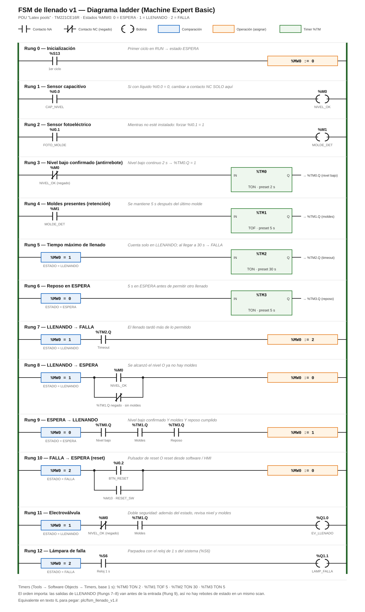

# Programa PLC — FSM de llenado v1

| Archivo | Contenido |
|---|---|
| [ladder_fsm_v1.svg](ladder_fsm_v1.svg) | Diagrama ladder de los 13 rungs (cómo debe verse en Machine Expert) |
| [fsm_llenado_v1.il](fsm_llenado_v1.il) | Mismo programa en texto IL, para copiar y pegar — **probado en físico** con capacitivo y electroválvula |
| [fsm_llenado_v2.il](fsm_llenado_v2.il) | v2: ultrasónico (control con histéresis) + fotoeléctrico + capacitivo como alto-alto + datos para monitoreo |

Lógica y diseño explicados en el [documento técnico](../proyecto_plc_tinas_latex.md#fsm-de-llenado-capacitivo--fotoeléctrico--timeout-lógica-actual-del-piloto).

---

## Guía paso a paso (Machine Expert Basic)

### Paso 0 — Respaldo
1. Abrir **FirstTest** y hacer **File → Save As** con el nombre `FirstTest_v0_rung_simple.smbp`, para guardar el programa actual.
2. Volver a guardar como `LatexPools_FSM_v1.smbp` y trabajar sobre ese archivo.

### Paso 1 — Símbolos de entradas y salidas
**Tools → I/O objects → Digital inputs:**

| Address | Symbol | Comment |
|---|---|---|
| %I0.0 | `CAP_NIVEL` | Sensor capacitivo Autonics CR18 |
| %I0.1 | `FOTO_MOLDE` | Receptor fotoeléctrico |
| %I0.2 | `BTN_RESET` | Pulsador reset de falla |

**Tools → I/O objects → Digital outputs** (en el módulo M1):

| Address | Symbol | Comment |
|---|---|---|
| %Q1.0 | `EV_LLENADO` | Relé K1 → electroválvula |
| %Q1.1 | `LAMP_FALLA` | Lámpara de falla |

Pulsar **Apply** en cada tabla.

### Paso 2 — Memorias
**Tools → Memory objects → Memory bits / Memory words:**

| Address | Symbol |
|---|---|
| %M0 | `NIVEL_OK` |
| %M1 | `MOLDE_DET` |
| %M10 | `RESET_SW` |
| %MW0 | `ESTADO` |

### Paso 3 — Timers
**Tools → Software Objects → Timers.** Configurar los cuatro con **Time base = 1 s**:

| Timer | Type | Preset | Symbol |
|---|---|---|---|
| %TM0 | TON | 2 | `T_NIVEL_BAJO` |
| %TM1 | TOF | 5 | `T_MOLDES` |
| %TM2 | TON | 30 | `T_TIMEOUT` |
| %TM3 | TON | 5 | `T_REPOSO` |

Marcar **Adjustable** para poder cambiar el preset en línea durante la calibración.

### Paso 4 — Borrar el rung actual
En **Programming**, seleccionar el `Rung0` actual (`START_` negado → `%Q1.0`) y borrarlo, o desactivarlo con la casilla verde de la izquierda. Si se deja, dos rungs escribirían `%Q1.0` y la válvula haría lo que diga el último.

### Paso 5 — Capturar los 13 rungs
Hay dos formas. Elegir una.

**Opción A — Pegar IL (más rápido)**
1. Insertar un rung nuevo (botón **Insert rung**, el primero de la barra).
2. Pulsar **> IL** en el rung.
3. Pegar el bloque de ese rung desde [fsm_llenado_v1.il](fsm_llenado_v1.il). Copiar solo las instrucciones; los comentarios `(* ... *)` se pueden poner en el campo *Comment* del rung.
4. Pulsar **> LD** y comparar con el [diagrama](ladder_fsm_v1.svg).
5. Repetir para los rungs 0 a 12, **en orden**.

**Opción B — Dibujar en ladder**
Usando la barra de herramientas de Programming:

| Elemento del diagrama | Herramienta |
|---|---|
| Contacto NA | Contacto normalmente abierto |
| Contacto NC (con diagonal) | Contacto normalmente cerrado |
| Bobina `( )` | Bobina |
| Caja azul `%MW0 = 1` | **Comparison block** → escribir `%MW0 = 1` |
| Caja naranja `%MW0 := 0` | **Operation block** → escribir `%MW0 := 0` |
| Caja verde `%TMx` | **Timer** (Function blocks) → elegir el número de timer |
| Rama en paralelo (Rungs 8 y 10) | Herramienta de **rama/OR** (línea vertical) bajo el primer contacto |

Rung por rung:

| Rung | Qué colocar (izquierda → derecha) |
|---|---|
| 0 | NA `%S13` → operación `%MW0 := 0` |
| 1 | NA `%I0.0` → bobina `%M0` |
| 2 | NA `%I0.1` → bobina `%M1` |
| 3 | NC `%M0` → timer `%TM0` (a la entrada IN) |
| 4 | NA `%M1` → timer `%TM1` |
| 5 | comparación `%MW0 = 1` → timer `%TM2` |
| 6 | comparación `%MW0 = 0` → timer `%TM3` |
| 7 | comparación `%MW0 = 1` → NA `%TM2.Q` → operación `%MW0 := 2` |
| 8 | comparación `%MW0 = 1` → [NA `%M0` **en paralelo con** NC `%TM1.Q`] → operación `%MW0 := 0` |
| 9 | comparación `%MW0 = 0` → NA `%TM0.Q` → NA `%TM1.Q` → NA `%TM3.Q` → operación `%MW0 := 1` |
| 10 | comparación `%MW0 = 2` → [NA `%I0.2` **en paralelo con** NA `%M10`] → operación `%MW0 := 0` |
| 11 | comparación `%MW0 = 1` → NC `%M0` → NA `%TM1.Q` → bobina `%Q1.0` |
| 12 | comparación `%MW0 = 2` → NA `%S6` → bobina `%Q1.1` |

### Paso 6 — Compilar
- La barra superior debe mostrar **No error**.
- Si aparece un error, revisar el panel **Messages** (Tools → Messages). Los más comunes:
  - **Rung incompleto:** algún elemento no está unido al riel.
  - **Dirección inexistente:** por ejemplo `%Q1.0` si el módulo M1 no está en Configuration.
  - **Timer sin configurar:** falta el tipo o el preset en Software Objects.

### Paso 7 — Descargar y tabla de animación
1. **Commissioning → Connect → PC to Controller** (descargar).
2. Crear una **Animation table** con:

| Variable | Qué mirar |
|---|---|
| `%MW0` | Estado: 0 / 1 / 2 |
| `%I0.0` y `%M0` | Sensor capacitivo |
| `%I0.1` | Forzar a 1 mientras no haya fotoeléctrico |
| `%TM0.V` | Cuenta de nivel bajo (0 → 2) |
| `%TM2.V` | Cuenta del timeout (0 → 30) |
| `%TM3.V` | Cuenta del reposo (0 → 5) |
| `%Q1.0` | Válvula |
| `%M10` | Reset por software |

3. Pasar el PLC a **RUN**.

### Paso 8 — Pruebas (en este orden)

| # | Acción | Debe pasar |
|---|---|---|
| 1 | Cubrir y descubrir el sensor | `%I0.0` cambia. **Si con líquido vale 0**, cambiar el contacto del Rung 1 a NC, volver a descargar y repetir. |
| 2 | Forzar `%I0.1 = 1`, sensor con líquido | `%MW0 = 0`, válvula cerrada |
| 3 | Quitar el líquido (descubrir) | `%TM0.V` sube a 2 → `%MW0 = 1` → `%Q1.0` = 1, válvula abre |
| 4 | Volver a cubrir | `%MW0 = 0` y válvula cierra **al instante** |
| 5 | Descubrir de inmediato | No abre hasta que `%TM3.V` llegue a 5 (reposo) y `%TM0.V` a 2 |
| 6 | Dejar descubierto (simula sensor dañado) | A los 30 s: `%MW0 = 2`, válvula cerrada, `%Q1.1` parpadea |
| 7 | Forzar `%M10 = 1` y regresarlo a 0 | `%MW0 = 0` |
| 8 | Quitar el forzado de `%I0.1` | Aunque falte líquido, **no llena** |

Para no esperar 30 s en la prueba 6, bajar el preset de `%TM2` a 10 en la tabla de timers. Después regresarlo a 30.

### Paso 9 — Registrar
- Anotar los resultados en el [registro de mediciones del piloto](../media/01-piloto/README.md#registro-de-mediciones).
- Grabar en video las pruebas 3, 4 y 6.
- Guardar el `.smbp` final en esta carpeta (`plc/`) y hacer commit.
