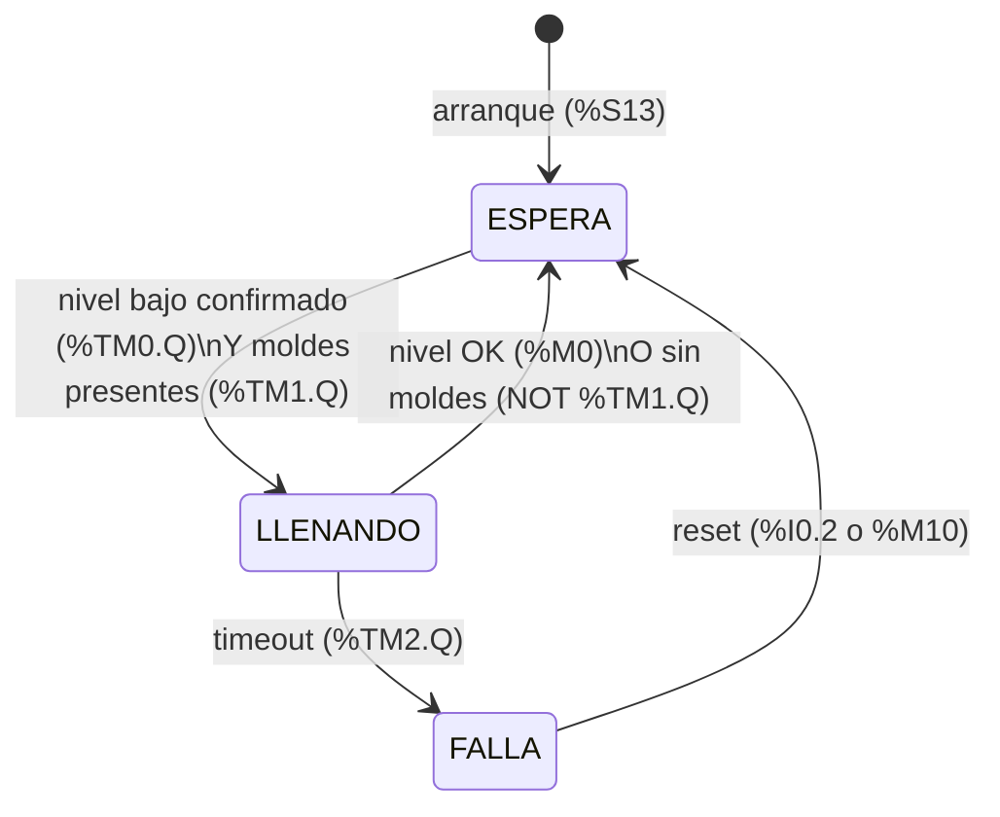

# Proyecto: Migración PLC — Línea de inmersión en látex (Productos Mayalatex, S.A.)

## Contexto general
- Migración del control de una línea industrial de inmersión en látex: **24 tinas en serie**, con etapa de presecado de coagulante y de látex.
- Control actual: dos Siemens LOGO! con ~48 relés. Plan: migrar a PLC Schneider.
- Incidente previo en producción: se rebalsaron tinas (motivador del proyecto).
- Ambiente de planta: ~50°C, presencia de amoniaco en los tanques de látex (afecta selección de cables/conectores: usar PUR, no PVC genérico; prensaestopas IP65/IP67).
- Para el despliegue completo a las 24 tinas: arquitectura centralizada de I/O remota (preferida sobre lógica local por grupo, aunque implica dependencia de red). Se evalúa usar sensores IO-Link en vez de salida analógica 4-20mA para reducir costo de módulos y facilitar recolección de datos/visualización.
- Ya en existencia en la empresa (reservados para el despliegue completo, no para el piloto): módulos **TM3DI16** y **TM3DQ16R**.

## Hardware del piloto (una sola tina)

### PLC
- **Modicon TM221CE16R**
  - 9 entradas digitales, 7 salidas de relé (2A), 2 entradas analógicas integradas (0-10V), 1 puerto serial (SL1), 1 puerto Ethernet (ETH1, Modbus TCP + EtherNet/IP)
  - Alimentación: **100-240VAC** (terminal de 3 bornes: L, N, PE) — NO es DC en este modelo
  - Fuente de sensores integrada: 24VDC a 250mA (puede alimentar sensores de bajo consumo sin fuente externa)
  - Firmware actualizado a **1.14.1.0** (se actualizó porque el proyecto tenía nivel funcional 14.0 y el firmware original 1.12.2.0 solo soportaba hasta 12.0)

### Módulo de expansión analógico
- **TM3AI2H/G** — 2 entradas analógicas de alta resolución (16 bits), acepta ±10V, 0-10V, 0-20mA, 4-20mA
- Comprado según cotización (proveedor SCP, Q2,200.00, cotización #26161)
- Agregado en IO Bus del proyecto como "Module 1", ocupa direcciones **%IW1.x**
- Nota de direccionamiento: en el bus TM3 la dirección depende de la **posición** del módulo. Como el TM3AI2H es el Module 1, un módulo de salidas digitales agregado después sería Module 2 → **%Q2.x** (no %Q1.x).

### Sensor de nivel (piloto analógico) — AÚN NO LLEGA
- **SICK UM18-21712D211**: ultrasónico, rango de detección 20-150mm, salida analógica **0-10V** (también soporta IO-Link)
- Conectado a **%IW1.0** (canal CH0 del TM3AI2H), Tipo configurado: 0-10V, Min/Max escalado: 20/150 (mm)
- Nota: durante la conversación se exploraron por error otros modelos de sensor UM18 con salida 4-20mA (UM18-218166101, UM18-217126111) — el sensor realmente en uso es el de salida 0-10V (UM18-21712D211)

### Sensores fotoeléctricos (emisor/receptor) — detección de moldes
- Tipo barrera: el **emisor** solo requiere alimentación (24VDC, 2 hilos); el **receptor** requiere alimentación + salida de señal (PNP/NPN) hacia una entrada digital del PLC → **%I0.1**
- Función: permisivo de llenado. **Si no detecta moldes, la tina no se llena** (evita llenar antes de que los moldes entren a la tina de látex).
- Pendiente: confirmar datasheet/modelo exacto para validar polaridad PNP/NPN, pinout del conector y modo **Light-ON / Dark-ON** del receptor (define si %I0.1 = ON significa "molde presente" o "haz libre").

### Sensor capacitivo (prueba simple, réplica de lo instalado actualmente en las tinas)
- **Autonics CR18-8A** (capacitivo, con electrodos auxiliares) — mismo tipo ya instalado en las tinas actuales
- Conectado a **%I0.0** (entrada digital integrada del PLC)
- ⚠️ Polaridad por confirmar en prueba física: la nota original dice que el sensor activa la señal cuando el nivel **sale** de su rango, pero el rung de prueba asume **%I0.0 = ON → hay líquido**. Ambas cosas no pueden ser ciertas a la vez. En la FSM la polaridad se ajusta en un solo rung (ver Rung 1).
- Pendiente: confirmar sufijo completo del modelo (en la serie CR, DN/DP son DC NPN/PNP; AO/AC son versiones de CA de 2 hilos que **no** se conectan directo a una entrada de 24VDC).

### Electroválvula (prueba simple)
- **Microair FV5221-8**, bobina **DC24V**, consumo **4.8W → 0.2A (200mA)**
- Corriente baja: cable 18-22 AWG es suficiente; el relé auxiliar y la salida de relé del PLC tienen margen de sobra
- Activada mediante **%Q0.0** (salida de relé integrada). Antes se había planteado %Q1.0, pero esa dirección solo existe si hay un módulo de salidas digitales en la posición 1 del bus, y ahí está el TM3AI2H.

## Mapa de I/O del piloto

| Dirección | Símbolo | Descripción | Estado |
|---|---|---|---|
| %I0.0 | CAP_NIVEL | Sensor capacitivo Autonics CR18-8A | Instalado (polaridad por confirmar) |
| %I0.1 | FOTO_MOLDE | Receptor fotoeléctrico de barrera | Por instalar |
| %I0.2 | BTN_RESET | Pulsador NA de reset de falla (opcional) | Opcional |
| %IW1.0 | NIVEL_US | Ultrasónico SICK UM18 (mm de distancia) | Sensor no ha llegado |
| %Q0.0 | EV_LLENADO | Relé auxiliar → electroválvula FV5221-8 | Instalado |
| %Q0.1 | LAMP_FALLA | Lámpara/indicador de falla (opcional) | Opcional |
| %M0 | NIVEL_OK | Nivel alcanzado (polaridad ya corregida) | Interno |
| %M1 | MOLDE_DET | Molde detectado (polaridad ya corregida) | Interno |
| %M2 | EV_ESPEJO | Copia de %Q0.0 para HMI | Interno / HMI |
| %M3 | MOLDES_ESPEJO | Copia de %TM1.Q para HMI | Interno / HMI |
| %M10 | RESET_SW | Reset de falla desde HMI o tabla de animación | Interno / HMI |
| %MW0 | ESTADO | Estado de la FSM (0/1/2) | Interno / HMI |
| %MW20–22 | PRESETS | Presets de %TM0–%TM2 ajustables desde HMI (s) | Interno / HMI |
| %MW30 | CNT_LLENADOS | Contador de llenados completados | Interno / HMI |
| %MW31 | CNT_FALLAS | Contador de fallas por timeout | Interno / HMI |
| %TM0 | T_NIVEL_BAJO | TON — confirma nivel bajo (antirrebote) | Interno |
| %TM1 | T_MOLDES | TOF — mantiene "moldes presentes" entre molde y molde | Interno |
| %TM2 | T_TIMEOUT | TON — tiempo máximo de llenado | Interno |

## Lógica ladder (EcoStruxure Machine Expert Basic)

### Rung simple de prueba (sensor capacitivo → electroválvula) — compila con 0 errores, falta prueba física
```
%I0.0 (negado, NC) ──────( ) %Q0.0
```
- Sensor detecta (I0.0 = ON, hay líquido) → contacto negado abierto → salida OFF → válvula cerrada
- Sensor deja de detectar (I0.0 = OFF, líquido bajó) → contacto negado cierra → salida ON → válvula abierta (llenando)
- ⚠️ Riesgo: si el cable del sensor se corta o pierde alimentación, I0.0 = OFF → la válvula abre y no cierra nunca (rebalse). Esta lógica se reemplaza por la FSM de abajo.

### FSM de llenado: capacitivo + fotoeléctrico + timeout (lógica actual del piloto)

**Objetivo:** llenar solo cuando (a) el nivel está bajo **y** (b) hay moldes en la línea; cortar si el llenado tarda más de lo normal (sensor dañado, válvula pegada, falta de suministro).

**Estados (`%MW0`):**

| Valor | Estado | Válvula | Descripción |
|---|---|---|---|
| 0 | ESPERA | OFF | Nivel OK o sin moldes. Estado inicial al pasar a RUN. |
| 1 | LLENANDO | ON | Nivel bajo confirmado y moldes presentes. Corre el timeout. |
| 2 | FALLA | OFF | El llenado superó el tiempo máximo. Queda enclavado hasta reset manual. |



**Temporizadores:**

| Timer | Tipo | Preset inicial | Función |
|---|---|---|---|
| %TM0 | TON | 2 s | El nivel debe estar bajo de forma continua 2 s antes de abrir (evita abrir/cerrar por oleaje del látex). |
| %TM1 | TOF | 5 s | "Moldes presentes" se mantiene 5 s después del último molde, para que el hueco entre moldes no corte el llenado. Ajustar al tiempo real entre moldes. |
| %TM2 | TON | 30 s | Tiempo máximo de llenado por ciclo. Calibrar: ~1.5–2× el tiempo normal de llenado medido. |

> Los presets son valores iniciales; se calibran en la prueba física.

**Rungs (en este orden):**

```
Rung 0  — Inicialización
  %S13 ─────────────────────────────────────────[ %MW0 := 0 ]

Rung 1  — Acondicionamiento sensor capacitivo
  %I0.0 ────────────────────────────────────────( ) %M0      NIVEL_OK
  (si la prueba muestra lógica inversa, cambiar a contacto negado SOLO aquí)

Rung 2  — Acondicionamiento sensor fotoeléctrico
  %I0.1 ────────────────────────────────────────( ) %M1      MOLDE_DET
  (si el receptor está en modo contrario, cambiar a contacto negado SOLO aquí)

Rung 3  — Confirmación de nivel bajo
  %M0 (negado) ─────────────────────────────────[ %TM0 TON 2s ]

Rung 4  — Retención de moldes presentes
  %M1 ──────────────────────────────────────────[ %TM1 TOF 5s ]

Rung 5  — Timeout de llenado
  [ %MW0 = 1 ] ─────────────────────────────────[ %TM2 TON 30s ]

Rung 6  — Transición LLENANDO → FALLA
  [ %MW0 = 1 ]──%TM2.Q ─────────────────────────[ %MW0 := 2 ]

Rung 7  — Transición LLENANDO → ESPERA
  [ %MW0 = 1 ]──┬── %M0 ──────────┬─────────────[ %MW0 := 0 ]
                └── %TM1.Q (neg) ─┘

Rung 8  — Transición ESPERA → LLENANDO
  [ %MW0 = 0 ]──%TM0.Q──%TM1.Q ─────────────────[ %MW0 := 1 ]

Rung 9  — Transición FALLA → ESPERA (reset)
  [ %MW0 = 2 ]──┬── %I0.2 ──┬───────────────────[ %MW0 := 0 ]
                └── %M10 ───┘

Rung 10 — Salida electroválvula (con enclavamientos redundantes)
  [ %MW0 = 1 ]──%M0 (neg)──%TM1.Q ──────────────( ) %Q0.0

Rung 11 — Indicador de falla (parpadeo 1 Hz con %S6)
  [ %MW0 = 2 ]──%S6 ────────────────────────────( ) %Q0.1
```

**Notas de diseño:**
- **Polaridad en un solo lugar:** toda la lógica usa %M0 y %M1, no las entradas físicas. Si un sensor resulta invertido, se corrige solo en el Rung 1 o el Rung 2.
- **Enclavamiento redundante en el Rung 10:** aunque la FSM tuviera un error, la válvula no abre si el nivel ya está OK o si no hay moldes.
- **Falla segura del fotoeléctrico:** si se corta su cable o se pierde el haz de forma permanente, se interpreta como "sin moldes" y no llena. (Verificar con el modo Light-ON/Dark-ON elegido: la falla debe dar "sin moldes".)
- **Falla del capacitivo:** si queda indicando "nivel bajo" permanentemente, el llenado se corta por timeout y la FSM pasa a FALLA.
- **Orden de rungs:** las transiciones que salen de LLENANDO (Rungs 6–7) van antes de la de entrada (Rung 8). Así no hay rebotes de estado dentro del mismo scan.
- **Limitación conocida:** el timeout es por ciclo. Si los moldes se pierden más de 5 s (TOF), el ciclo termina y el contador se reinicia al siguiente ciclo.
- Sin pulsador físico, el reset se hace forzando %M10 = 1 desde la tabla de animación (y regresándolo a 0).

### Lógica futura con sensor ultrasónico (cuando llegue el UM18)
- El UM18 mide **distancia del sensor a la superficie**, no nivel: tina baja = distancia **mayor**. La condición de nivel bajo es `%IW1.0 >= umbral`, no `<=`.
- El umbral debe estar **dentro del escalado 20–150 mm** (el `<= 200` planteado antes se cumplía siempre).
- Plan: el ultrasónico sustituye o complementa a %M0 con histéresis (dos umbrales: abrir y cerrar), manteniendo la misma FSM, el permisivo de moldes y el timeout. Se descarta el llenado por tiempo fijo con TP, porque no tiene realimentación de nivel.
- Para detección de falla: revisar el bit/diagnóstico de fuera de rango del TM3AI2H (por ejemplo, cable cortado → 0V).

## HMI Wecon

### Arquitectura
```
[HMI Wecon] ──Ethernet── [Switch] ──Ethernet── [TM221CE16R ETH1]
                                  └─────────── [PC con Machine Expert] (opcional)
```
- **Protocolo recomendado: Modbus TCP.** El HMI es cliente (maestro) y el TM221 es servidor (esclavo) en el puerto 502.
- Alternativa: Modbus RTU por el puerto serial SL1 (RS-485). Se reserva por si el HMI no tiene Ethernet o si ETH1 se ocupa para otra cosa.
- Software según la serie del HMI: **PIStudio** (serie PI) o **LeviStudioU** (serie LEVI). Pendiente confirmar el modelo.
- En el software del HMI: usar el driver **Modbus TCP master** genérico. Si trae un driver específico de Schneider M221, también sirve.

### Configuración en el TM221 (Machine Expert Basic)
1. Configuration → ETH1: asignar **IP fija**, por ejemplo `192.168.1.10 / 255.255.255.0`.
2. Habilitar **Modbus TCP server** en ETH1.
3. HMI en la misma subred, por ejemplo `192.168.1.20`, con la IP del PLC como destino, puerto 502 y Unit ID 1 (verificar; el M221 suele aceptar cualquier ID por TCP).

### Mapeo de variables
Regla: **el HMI solo lee/escribe %M y %MW.** No accede directo a %I ni %Q. El programa copia las entradas y salidas físicas a bits internos. Así el HMI nunca puede forzar una salida saltándose la FSM.

| Variable PLC | Tipo Modbus | Acceso HMI | Uso |
|---|---|---|---|
| %MW0 | Holding register 0 | Lectura | Estado FSM (0 ESPERA / 1 LLENANDO / 2 FALLA) |
| %M0 | Coil 0 | Lectura | Nivel OK |
| %M1 | Coil 1 | Lectura | Molde detectado |
| %M2 | Coil 2 | Lectura | Copia de %Q0.0 (válvula abierta) |
| %M3 | Coil 3 | Lectura | Copia de %TM1.Q (moldes presentes, filtrado) |
| %M10 | Coil 10 | Escritura (botón momentáneo) | Reset de falla |
| %MW20 | Holding register 20 | Lectura/escritura | Preset %TM0 nivel bajo (s) |
| %MW21 | Holding register 21 | Lectura/escritura | Preset %TM1 hueco entre moldes (s) |
| %MW22 | Holding register 22 | Lectura/escritura | Preset %TM2 tiempo máximo de llenado (s) |
| %MW30 | Holding register 30 | Lectura | Contador de llenados completados |
| %MW31 | Holding register 31 | Lectura | Contador de fallas por timeout |
| %MW40 | Holding register 40 | Lectura | Nivel ultrasónico en mm (fase 2) |

> ⚠️ **Offset de direcciones:** muchos HMI usan numeración base 1 (40001 = registro 0 = %MW0; 00001 = coil 0 = %M0). Antes de armar todas las pantallas, verificar con una variable de prueba: escribir un valor conocido en %MW0 desde Machine Expert y confirmar que el HMI lo lee en la dirección esperada.

### Rungs adicionales para el HMI
```
Rung 12 — Espejo de salida y moldes para HMI
  %Q0.0 ─────────────────────────────────────────( ) %M2
  %TM1.Q ────────────────────────────────────────( ) %M3

Rung 13 — Presets ajustables desde HMI (con límites)  → insertar ANTES del Rung 3
  [ %MW20 >= 1 ]──[ %MW20 <= 10 ]─────────────────[ %TM0.P := %MW20 ]
  [ %MW21 >= 1 ]──[ %MW21 <= 60 ]─────────────────[ %TM1.P := %MW21 ]
  [ %MW22 >= 5 ]──[ %MW22 <= 120 ]────────────────[ %TM2.P := %MW22 ]

Rung 14 — Contadores para métricas  → se integran en las transiciones
  Rung 6 (LLENANDO → FALLA): agregar en paralelo a [ %MW0 := 2 ] el bloque [ %MW31 := %MW31 + 1 ]
  Rung 7a (nuevo, justo ANTES del Rung 7):
  [ %MW0 = 1 ]──%M0 ──────────────────────────────[ %MW30 := %MW30 + 1 ]
```
- Los límites del Rung 13 evitan que un valor erróneo desde el HMI (por ejemplo, 0 s de timeout) deje la tina sin protección. Ajustar los rangos al proceso real.
- Los presets usan **base de tiempo de 1 s** en %TM0–%TM2. Si se cambia la base de tiempo, cambia la unidad.
- Para escribir %TMi.P desde el programa, el timer debe tener habilitada la opción de preset ajustable (Adjustable) en su configuración.
- Los valores iniciales de %MW20–22 (2 / 5 / 30) se cargan en el Rung 0 con %S13, o se marcan como memoria retenida para que se conserven tras un corte de energía.
- Los contadores de llenados (%MW30) y fallas (%MW31) son la base de las métricas antes/después del README.
- Los contadores van en las transiciones porque esas condiciones se cumplen **una sola vez por ciclo**: en el mismo scan el estado cambia y el rung ya no vuelve a cumplirse. Si se pusieran después del Rung 7, el estado ya sería 0 y no contarían.

### Pantallas propuestas
1. **Principal:** estado de la FSM (texto + color: gris ESPERA, verde LLENANDO, rojo FALLA), indicadores de nivel OK, moldes y válvula, y tiempo de llenado en curso.
2. **Alarmas:** falla por timeout con fecha/hora (historial de alarmas del HMI) y botón de **reset** (momentáneo sobre %M10).
3. **Parámetros (con contraseña):** presets de %MW20–22, mostrando el rango permitido.
4. **Contadores:** llenados y fallas, con botón de puesta a cero protegido.
5. **Tendencia (fase 2):** curva de nivel del ultrasónico (%MW40).

> No se incluye modo manual de la válvula en esta etapa. Si se agrega, debe respetar los enclavamientos de nivel y del timeout.

### Alimentación del HMI
- Los HMI Wecon normalmente se alimentan a **24VDC** (confirmar en el datasheet del modelo).
- La fuente de sensores integrada del TM221 (250mA) **no alcanza**. Se necesita una **fuente 24VDC externa** (por ejemplo 2.5A en riel DIN), que también puede alimentar sensores, el relé auxiliar y la válvula.

## Conexiones eléctricas (esquemas acordados)

### Entradas
- **Sensor nivel (SICK UM18, 0-10V)** → TM3AI2H canal CH0 (%IW1.0). Alimentación 24VDC al sensor, común compartido con el módulo.
- **Fotoeléctrico — Emisor**: solo alimentación 24VDC, sin conexión al PLC, proyecta haz hacia el receptor.
- **Fotoeléctrico — Receptor**: alimentación 24VDC + salida de señal → **%I0.1**.
- **Sensor capacitivo (Autonics CR18-8A)**: alimentación 24VDC + salida digital → %I0.0.
- **Común de entradas (COM0):** se cablea como sink o source según la polaridad de los sensores (PNP → COM0 a 0V; NPN → COM0 a +24V). Todos los sensores del mismo grupo de común deben tener la misma polaridad.

### Salidas
- Patrón repetible por cada tina/válvula: **Salida de relé del PLC (Qx)** → activa bobina de un **relé auxiliar** (24VDC) → el contacto del relé auxiliar conmuta la alimentación real de la **electroválvula** correspondiente.
- Para el piloto: electroválvula DC24V de bajo consumo (200mA) — técnicamente la salida de relé del PLC (2A) podría manejarla directo, pero se usa relé auxiliar igual por buena práctica (aislamiento, protección contra pico inductivo del solenoide).
- Diodo de rueda libre recomendado en la bobina del relé auxiliar y en el solenoide de 24VDC.

### Alimentación principal del PLC
- **100-240VAC** en terminales **L, N** (no es DC, no tiene polaridad +/-; L y N alternan constantemente, no confundir con positivo/negativo)
- **PE (tierra)** conectado directo a tierra física — crítico para seguridad e inmunidad a ruido
- Se recomienda interruptor termomagnético + fusible tipo T antes del PLC

## Software / Commissioning — estado y problemas resueltos
1. **Error "functional levels not compatible"** (proyecto nivel 14.0 vs firmware máximo 12.0 soportado) → resuelto actualizando firmware del PLC a 1.14.1.0 desde Commissioning → Controller Update.
2. **"PC to Controller" inactivo** → causa: errores de compilación pendientes (rung incompleto con elementos sueltos) → resuelto al completar el rung correctamente (0 errores, 0 advertencias).
3. **Error en rung**: dos contactos en serie ambos asignados a %I0.0 (uno normal + uno negado) → lógica imposible de cumplir → se corrigió dejando un solo contacto negado.
4. **Estado "Powerless"** tras la descarga: el PLC conectado solo por USB no tiene alimentación principal (100-240VAC) — sin ella no entra en modo RUN real. Pendiente de confirmación si ya se resolvió tras conectar L/N/tierra.
5. **Error de comunicación tras conectar alimentación** ("Communication detected error... verify USB cable, Modbus Driver parameters, controller connection or power supply") — posibles causas a revisar: cable USB, estabilidad de la alimentación principal, puerto COM reasignado, u otro software usando el puerto. Pendiente de resolución.

## Pendientes / próximos pasos
- [ ] Prueba física del capacitivo: confirmar si %I0.0 = ON significa "hay líquido" o "sin líquido" y ajustar el Rung 1
- [ ] Confirmar sufijo completo del Autonics CR18-8A (DC NPN/PNP vs. AC)
- [ ] Confirmar datasheet/modelo exacto de los sensores fotoeléctricos (PNP/NPN, pinout, modo Light-ON/Dark-ON) y ajustar el Rung 2
- [ ] Medir el tiempo normal de llenado y calibrar el preset de %TM2 (timeout)
- [ ] Medir el tiempo entre moldes y calibrar el preset de %TM1 (TOF)
- [ ] Cargar la FSM en Machine Expert Basic y probar cada transición, incluida la FALLA por timeout (simular desconectando el capacitivo)
- [ ] Decidir si se instala pulsador de reset (%I0.2) y lámpara de falla (%Q0.1)
- [ ] Resolver el error de comunicación actual tras conectar alimentación principal
- [ ] Verificar consumo del sensor capacitivo y del fotoeléctrico contra el límite de 250mA de la fuente de sensores integrada del PLC
- [ ] HMI Wecon: confirmar modelo, software (PIStudio / LeviStudioU), puertos y alimentación
- [ ] Conseguir fuente 24VDC externa en riel DIN para HMI y periferia
- [ ] Configurar IP fija y Modbus TCP server en ETH1 del TM221
- [ ] Verificar offset de direcciones Modbus entre HMI y PLC con una variable de prueba
- [ ] Implementar Rungs 12–14 (espejos, presets con límites, contadores) y pantallas del HMI
- [ ] Documentación visual: fotos/videos del estado actual antes de modificar nada (ver README)
- [ ] Al llegar el ultrasónico: integrar a la FSM con histéresis (ver "Lógica futura")
- [ ] Confirmar voltaje/corriente de las bobinas de las electroválvulas reales de producción antes de dimensionar relés para el despliegue a 24 tinas
- [ ] Definir arquitectura final de I/O remota centralizada para las 24 tinas (evaluar límites de módulos TM3 del M221 vs. M241/M251, y soporte de maestro IO-Link)

## Referencias
- Manual oficial Modicon M221 Logic Controller — Hardware Guide (PDF): https://media.distributordatasolutions.com/schneider_synd/2023q2/documents/7b507a5b3fa61db9cd3e81af48f85472c3402124.pdf
- EcoStruxure Machine Expert - Basic — Operating Guide (PDF): https://cdn.i-pulse.nl/isotron/production/products/2616/EcoStruxure%20Machine%20Expert%20-%20Basic,%20Operating%20Guide.pdf
